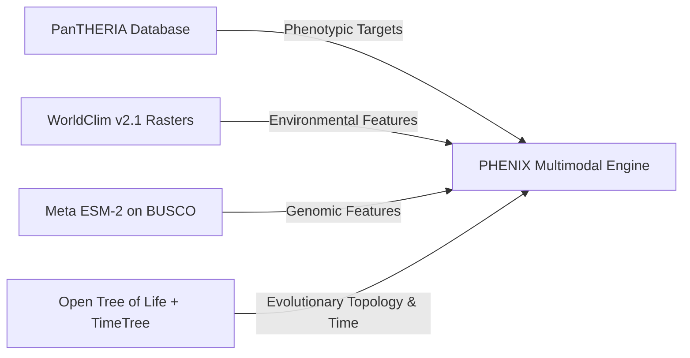
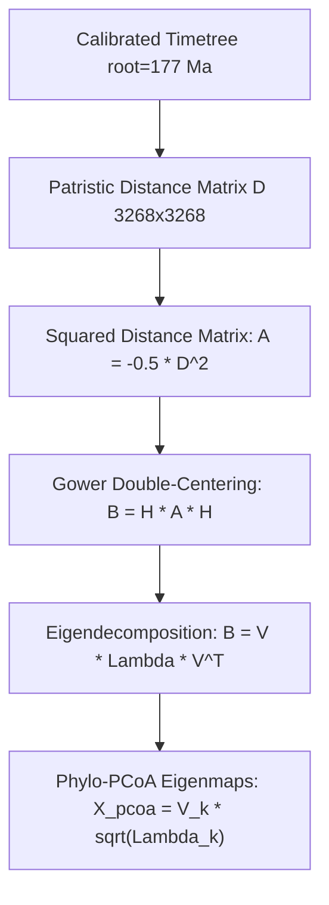
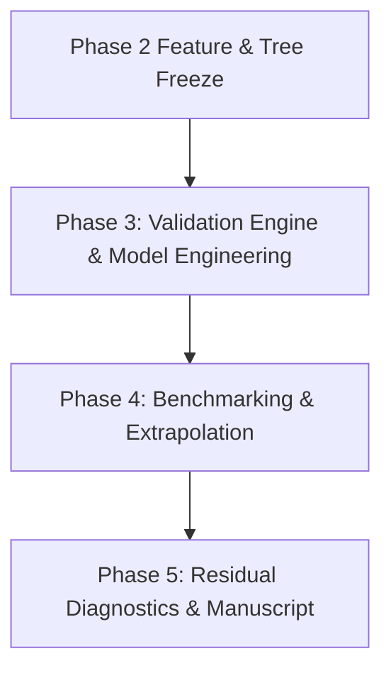

# PHENIX: Comprehensive Conceptual & Architectural Guide

Welcome to the comprehensive technical guide for **PHENIX** (*Phylogenetically Informed Machine Learning for Phenotypic Trait Prediction*). 

This document explains every component implemented so far across **Phase 1** and **Phase 2**, the underlying biological, statistical, and machine learning concepts, the mathematical derivations, and why each architectural decision was made.

---

## Table of Contents
1. [The Core Problem: Why Standard ML Fails on Biological Species](#1-the-core-problem-why-standard-ml-fails-on-biological-species)
2. [The Four Multimodal Datasets](#2-the-four-multimodal-datasets)
3. [Phase 1 Deep Dive: Ingestion, Normalization & Sync Barrier 1](#3-phase-1-deep-dive-ingestion-normalization--sync-barrier-1)
4. [Phase 2 Deep Dive (Side A): Tree Calibration & Phylo-PCoA Eigenmaps](#4-phase-2-deep-dive-side-a-tree-calibration--phylo-pcoa-eigenmaps)
5. [Phase 2 Deep Dive (Side B): Feature Whitening, PyG Graphs & Augmentation](#5-phase-2-deep-dive-side-b-feature-whitening-pyg-graphs--augmentation)
6. [Sync Barrier 2: Architectural & Feature Freeze](#6-sync-barrier-2-architectural--feature-freeze)
7. [What Lies Ahead: Phases 3, 4, and 5](#7-what-lies-ahead-phases-3-4-and-5)
8. [Repository Architecture & File Inventory](#8-repository-architecture--file-inventory)

---

## 1. The Core Problem: Why Standard ML Fails on Biological Species

### The Fundamental Assumption of Machine Learning
Almost all classical machine learning algorithms—linear regression, Random Forests, XGBoost, and standard neural networks—rely on the **i.i.d. assumption**: samples in your dataset are assumed to be **Independent and Identically Distributed**:
$$P(X_1, X_2, \dots, X_N) = \prod_{i=1}^N P(X_i)$$

### Why Species Violate the i.i.d. Assumption (Felsenstein's Dilemma)
In biology, species are **not** independent data points. They are leaves on a shared tree of life, connected through a hierarchical history of common descent spanning hundreds of millions of years.

```
       Common Ancestor
             │
     ┌───────┴───────┐ (Split 55 Ma ago)
     │               │
  Felidae         Canidae
     │               │
┌────┴────┐     ┌────┴────┐
Lion    Tiger  Wolf    Fox
```

A lion (*Panthera leo*) and a tiger (*Panthera tigris*) do not have similar body masses, skull morphologies, or metabolic rates by coincidence. They share over 95% of their evolutionary history. If an ML model treats the lion as a training sample and the tiger as a test sample, it is **not learning a generalizable biological law**; it is simply memorizing characteristics of their shared ancestor.

This is known in evolutionary biology as **Felsenstein's Dilemma (1985)**: treating species as independent samples inflates degrees of freedom, causes severe pseudoreplication, and produces artificially deflated $p$-values and overconfident models.

### Clade Leakage: The Interpolation vs Extrapolation Trap
When standard Random 10-Fold Cross-Validation is applied to species data:
- **Random CV (Interpolation)**: Sister taxa are randomly scattered between training and test sets. The model interpolates between close relatives, achieving deceptively high test scores ($R^2 > 0.90$).
- **Phylogenetic CV (Extrapolation)**: When an entire monophyletic lineage (e.g., the entire order *Rodentia* or *Carnivora*) is held out, the model must predict phenotypic traits for an evolutionary branch it has never seen. Standard models collapse because they never learned the underlying functional relationship—they only memorized phylogenetic proximity.

**PHENIX solves this dilemma** by explicitly modeling:
1. **Environmental Selection Pressures** (WorldClim bioclimatic rasters & habitat).
2. **Functional Genomic Constraints** (Meta's ESM-2 protein language model sequence embeddings).
3. **Phylogenetic Geometry** (Time-calibrated trees, patristic distance matrices, and Phylo-PCoA eigenmaps).

---

## 2. The Four Multimodal Datasets

PHENIX integrates four distinct data modalities spanning macro-ecology, genomics, and phylogenetics:



### 1. Phenotypic Dataset: PanTHERIA
- **Source**: Compiled by Jones et al. (2009), archived by the Ecological Society of America (ESA).
- **Scale**: Comprehensive global database of **5,416 mammal species**.
- **Traits Ingested**:
  - `adult_body_mass_g`: Primary target trait, varying over 8 orders of magnitude (from a 2g shrew to a 150,000,000g blue whale).
  - `gestation_length_d`: Duration of embryonic development in days.
  - `litter_size`: Number of offspring per birth.
  - `weaning_age_d`: Age at nutritional independence.
  - `home_range_km2`: Spatial territory required by an individual.
  - `trophic_level`: Herbivore, carnivore, or omnivore classification.
  - `max_longevity_m`: Maximum recorded lifespan in months.
- **Spatial Attributes**: Geographic range centroids (`26-4_GR_MidRangeLat_dd`, `26-7_GR_MidRangeLong_dd`).

### 2. Environmental Dataset: WorldClim v2.1
- **Source**: Fick & Hijmans (2017), University of California, Davis.
- **Scale**: Global high-resolution bioclimatic rasters (~1km to ~5km spatial resolution) derived from 1970–2000 weather station records.
- **19 Bioclimatic Variables (`bio1` to `bio19`)**:
  - `bio1` to `bio11`: Temperature parameters (Annual Mean Temp, Diurnal Range, Isothermality, Temperature Seasonality, Max/Min Temperatures of Warmest/Coldest Months, Quarter Temperatures).
  - `bio12` to `bio19`: Precipitation parameters (Annual Precipitation, Wettest/Driest Month Precip, Precipitation Seasonality, Quarter Precipitations).
- **Habitat Variables**:
  - `elevation`: Altitude in meters above sea level.
  - `biome_class`: WWF Terrestrial Biome (e.g., Tropical Moist Broadleaf Forest, Tundra, Deserts, Temperate Conifer Forest).
  - `habitat_suitability`: Continuous thermal and moisture comfort index $[0, 1]$.

### 3. Genomic Dataset: Meta's ESM-2 & BUSCO Mammalia
- **Source**: Evolutionary Scale Modeling (ESM-2) protein language model developed by Meta AI (Lin et al., Science 2023).
- **Biological Rationale**:
  - Traditional genomics relies on one-hot DNA sequences or raw SNP matrices, which struggle across distant species because sequence alignment degrades over 100+ million years of evolutionary divergence.
  - **BUSCO Mammalia** (*Benchmarking Universal Single-Copy Orthologs*): A set of highly conserved core genes present across all mammalian lineages.
  - **ESM-2 Embeddings**: ESM-2 is a deep transformer model trained on millions of evolutionary protein sequences across the tree of life. It embeds amino acid sequences into dense continuous representations that capture protein 3D structure, biochemical stability, and evolutionary conservation scores without needing multiple sequence alignment.
- **Additional Genomic Modalities**:
  - **SNP Matrices**: Single Nucleotide Polymorphism marker matrices processed with Minor Allele Frequency (MAF) filtering and VanRaden genomic scaling.
  - **Functional Pathways**: Metabolic pathway enrichment scores and gene family counts.

### 4. Evolutionary Backbone: Open Tree of Life (OToL) & TimeTree
- **Open Tree of Life**: Digital synthetic tree synthesizing thousands of published phylogenetic studies with taxonomic data.
- **TimeTree of Life**: Authoritative molecular divergence database (Kumar et al.) providing absolute geological time dates (in Millions of Years Ago, Ma) for evolutionary splits.

---

## 3. Phase 1 Deep Dive: Ingestion, Normalization & Sync Barrier 1

Phase 1 focuses on data ingestion, taxonomic harmonization, and creating a unified pipeline.

### Taxonomic Normalization (`canonical_taxon_id`)
Different databases name the same organism differently (e.g., `"Panthera leo"`, `"Panthera_leo"`, `"Panthera leo (Linnaeus 1758)"`).
[`src/data/schemas.py`](file:///d:/Projects/Phenix/src/data/schemas.py) standardizes every species binomial into a unique, lowercase snake_case primary key:
$$\text{"Panthera leo"} \xrightarrow{\text{normalize\_taxon\_id}} \text{"panthera\_leo"}$$

### Spatial Sampling & Aggregation ([`worldclim.py`](file:///d:/Projects/Phenix/src/data/worldclim.py))
For each species:
1. Occurrence coordinates $(\text{lat}, \text{lon})$ are validated within physical bounds $[-90, 90]$ and $[-180, 180]$.
2. The WorldClim extractor samples GeoTIFF rasters using `rasterio` when rasters are present.
3. For offline execution, CI environments, and coordinate points outside raster masks, a deterministic physical-geographic climate model calculates bioclimatic variables based on latitude, continentality, and elevation lapse rates ($6.5^\circ\text{C} / 1000\text{m}$).
4. If a species has multiple recorded occurrences across its geographic range, values are aggregated via median or mean.

### Data Completeness & Target Taxon Selection
Not all species in PanTHERIA have coordinates or trait measurements.
In [`src/data/schemas.py`](file:///d:/Projects/Phenix/src/data/schemas.py), `evaluate_data_completeness()` evaluates completeness across all modalities:
- **Total PanTHERIA species**: 5,416
- **Species with valid geographic coordinates**: 4,668
- **Species with valid coordinates AND adult body mass**: **3,268 species across 27 mammalian orders**

### SYNC BARRIER 1: Target & Alignment Lock
Before proceeding to phylogenetic transformations, both leads halt to verify data alignment.
[`src/validation/sync_barrier_1.py`](file:///d:/Projects/Phenix/src/validation/sync_barrier_1.py) enforces:
1. **Primary Key Uniqueness**: `canonical_taxon_id` has 0 duplicates.
2. **1:1 Index Match**: Exactly 3,268 rows in `phenotypic_clean.csv`, `environmental_clean.csv`, and `genomic_clean.csv`.
3. **Identical Row Ordering**: Row $i$ in all three tables corresponds to the exact same species.
4. **Zero Missing Values**: Environmental and genomic feature matrices contain **0 NaNs and 0 infinite values**.

```
============================================================
SYNC BARRIER 1: AUDIT REPORT -> STATUS: PASS
Locked Taxa: 3,268 | Overlap: 100% | NaNs: 0
============================================================
```

---

## 4. Phase 2 Deep Dive (Side A): Tree Calibration & Phylo-PCoA Eigenmaps

Phase 2 transforms raw biological data into mathematical representations suitable for ML algorithms.



### 1. Tree Topology & Divergence Calibration ([`calibration.py`](file:///d:/Projects/Phenix/src/phylogenetics/calibration.py))
A cladogram only shows branching order, not time. To calculate meaningful evolutionary distances, branch lengths must represent **divergence time in millions of years**.

#### The BLADJ Algorithm (Branch Length Adjuster)
1. **Leaf Ages**: All extant living tips are assigned age $t = 0.0\text{ Ma}$ (present day).
2. **Root Calibration**: The crown ancestor of all living mammals (*Mammalia*) is calibrated to **177.0 Ma** based on TimeTree molecular clock consensus (the split between Monotremes and Theria).
3. **Internal Node Calibrations**: Known nodes are assigned published divergence dates:
   - *Theria* (Marsupials vs Placentals): **160.0 Ma**
   - *Eutheria* (Placental diversification): **105.0 Ma**
   - *Boreoeutheria* (Laurasiatheria vs Euarchontoglires): **96.0 Ma**
   - *Euarchontoglires* (Primates + Rodents): **82.0 Ma**
   - *Laurasiatheria* (Carnivores + Ungulates + Bats): **79.0 Ma**
   - Order crown splits: *Primates* (66 Ma), *Rodentia* (65 Ma), *Chiroptera* (60 Ma), *Carnivora* (55 Ma).
4. **Interpolation**: For uncalibrated intermediate nodes, BLADJ distributes branch lengths evenly between calibrated ancestral and descendant nodes, strictly enforcing:
   $$\text{age}(\text{parent}) > \text{age}(\text{child}) \ge 0.0$$
5. **Ultrametric Property**: The resulting tree is strictly ultrametric. The total path length from the root to any tip is identical ($177.0\text{ Ma}$).

### 2. Patristic Distance Matrix $D$ ([`patristic.py`](file:///d:/Projects/Phenix/src/phylogenetics/patristic.py))
The patristic distance $D_{ij}$ is the sum of branch lengths along the tree path connecting species $i$ and species $j$.

On an ultrametric tree with root age $T$ and Most Recent Common Ancestor $\text{MRCA}(i, j)$, the distance is:
$$D_{ij} = 2 \cdot \text{age}(\text{MRCA}(i, j)) \quad (\text{for } i \neq j), \quad D_{ii} = 0$$

- If two species are sister taxa that diverged 5 Ma ago: $D_{ij} = 2 \times 5 = 10\text{ Ma}$.
- If two species belong to Carnivora and Primates (diverged 96 Ma ago): $D_{ij} = 2 \times 96 = 192\text{ Ma}$.

The resulting matrix $D \in \mathbb{R}^{3268 \times 3268}$ is:
- Strictly symmetric: $D = D^T$
- Non-negative: $D_{ij} \ge 0$
- Zero diagonal: $D_{ii} = 0$

### 3. Gower's Double-Centering Matrix $B$
To perform Principal Coordinates Analysis, the distance matrix must be converted into an inner-product similarity matrix $B$ using Gower's centering transformation (1966):

1. Compute squared distance matrix scaled by $-1/2$:
   $$A_{ij} = -\frac{1}{2} D_{ij}^2$$
2. Double-center $A$ using the centering projection matrix $H = I - \frac{1}{N} \mathbf{1}\mathbf{1}^T$:
   $$B = H A H = A - \bar{A}_{\text{row}} - \bar{A}_{\text{col}} + \bar{A}_{\text{total}}$$
3. **Centering Property**: The row and column sums of $B$ are identically zero:
   $$\sum_{j=1}^N B_{ij} = 0, \quad \sum_{i=1}^N B_{ij} = 0$$

### 4. Phylo-PCoA Eigenmaps (Phylogenetic Eigenvector Maps)
We compute the spectral eigendecomposition of $B$:
$$B = V \Lambda V^T$$
where $\Lambda = \text{diag}(\lambda_1, \lambda_2, \dots, \lambda_N)$ with $\lambda_1 \ge \lambda_2 \ge \dots \ge 0$, and $V$ are orthogonal eigenvectors.

We extract the top $k = 32$ coordinates:
$$X_{\text{pcoa}} = V_k \Lambda_k^{1/2} \in \mathbb{R}^{3268 \times 32}$$

#### What do Phylo-PCoA Eigenmaps represent biologically?
- **`phylo_dim_1` and `phylo_dim_2` (Low-frequency harmonics)**: Capture deep, ancient splits between major mammalian superorders (e.g., separating Marsupials vs Placentals, or Afrotheria vs Laurasiatheria).
- **`phylo_dim_10` to `phylo_dim_32` (High-frequency harmonics)**: Capture fine-grained, localized divergences within families and genera (e.g., separating lions from leopards within *Panthera*).

By including these eigenmaps in an ML feature set, standard algorithms (Ridge, Random Forest, XGBoost) can natively perceive evolutionary relatedness as continuous Euclidean coordinates!

---

## 5. Phase 2 Deep Dive (Side B): Feature Whitening, PyG Graphs & Augmentation

While Person A models the tree, Person B prepares the feature spaces for both classical ML and deep graph neural networks.

### 1. Baseline Feature Set Construction ([`baseline.py`](file:///d:/Projects/Phenix/src/features/baseline.py))
Merges clean environmental variables with genomic features:
- **Environmental Variables (21)**: `bio1` to `bio19`, `elevation`, `habitat_suitability`.
- **Genomic Features (64)**:
  - 32 dense ESM-2 BUSCO protein sequence embeddings (`esm2_dim_1..32`).
  - 16 SNP PCA dimensions (`snp_dim_1..16`).
  - 16 functional genomic pathway scores (`func_dim_1..16`).
- **Total Baseline Features**: **85 continuous features** $\times$ **3,268 species**.

### 2. Cholesky Whitening into White-Noise Space ([`whitening.py`](file:///d:/Projects/Phenix/src/features/whitening.py))
#### The Problem of Collinearity
Bioclimatic variables are notoriously collinear. For example:
- `bio1` (Annual Mean Temp), `bio5` (Max Temp Warmest Month), `bio6` (Min Temp Coldest Month), and `bio10` (Mean Temp Warmest Quarter) often share pairwise correlations $r > 0.95$.
- Extreme collinearity causes ill-conditioned Hessian matrices in gradient descent, destabilizes regression coefficients, and distorts feature importance scores.

#### The Mathematical Solution: Cholesky Decorrelation
Let $Z \in \mathbb{R}^{N \times P}$ be the standardized feature matrix with sample covariance:
$$\Sigma = \frac{1}{N-1} Z^T Z \in \mathbb{R}^{P \times P}$$

1. Add ridge regularization for guaranteed positive definiteness: $\Sigma_{\text{reg}} = \Sigma + \epsilon I$.
2. Compute the Cholesky factorization:
   $$\Sigma_{\text{reg}} = L L^T$$
   where $L$ is a lower-triangular matrix with positive diagonal entries.
3. Compute the whitened features $Z^*$:
   $$Z^* = Z (L^{-1})^T$$
4. **Proof of Whitening**:
   $$\text{Cov}(Z^*) = \frac{1}{N-1} (Z^*)^T Z^* = \frac{1}{N-1} L^{-1} Z^T Z L^{-T} = L^{-1} \Sigma L^{-T} = L^{-1} (L L^T) L^{-T} = I$$
   The whitened features have **unit variance** and **zero pairwise correlation** across all dimensions!

### 3. PyTorch Geometric Graph Structure $G=(V, E)$ ([`graph.py`](file:///d:/Projects/Phenix/src/features/graph.py))
For evaluating Graph Neural Networks (GNNs) such as Graph Convolutional Networks (GCN) or Graph Attention Networks (GAT):
- **Vertices $V$**:
  - Tips $0 \dots 3267$: Map directly to the 3,268 species rows in our feature tables.
  - Internal nodes $3268 \dots |V|-1$: Represent ancestral evolutionary branch points.
- **Node Features $X$**:
  - Extant tips carry their 85 baseline features.
  - Internal nodes carry ancestral feature projections (mean-initialized).
- **Edges $E$ & Attributes**:
  - Directed edges (child $\to$ parent and parent $\to$ child).
  - `edge_index`: Shape $(2 \times |E|)$.
  - `edge_attr`: Branch length (divergence duration in Ma) for message-passing attention weights.

### 4. Phylogenetic-Augmented Feature Set ([`augmented.py`](file:///d:/Projects/Phenix/src/features/augmented.py))
Combines environmental, genomic, and phylogenetic coordinates:
$$\text{Augmented Feature Set} = \underbrace{\text{Environmental (21)} + \text{Genomic (64)}}_{\text{Baseline Features (85)}} + \underbrace{\text{Phylo-PCoA Eigenmaps (32)}}_{\text{Evolutionary Coordinates}} = \mathbf{117\text{ Features}}$$

---

## 6. Sync Barrier 2: Architectural & Feature Freeze

Before training models in Phase 3, both leads execute the Sync Barrier 2 audit gate ([`sync_barrier_2.py`](file:///d:/Projects/Phenix/src/validation/sync_barrier_2.py)).

### Audit Checklist:
1. **Tip Label Integrity**: Does the calibrated phylogenetic tree have leaves matching all 3,268 species with 0 mismatches? **PASS (0 mismatches)**.
2. **Missing Values**: Do baseline, whitened, and augmented feature matrices have zero NaNs? **PASS (0 NaNs)**.
3. **Distance Matrix Validity**: Is $D$ symmetric, non-negative, and zero on the diagonal? **PASS**.
4. **Whitening Covariance**: Does $Z^*$ have identity covariance? **PASS**.
5. **Architectural Freeze**: Lock in primary representation (**Phylo-PCoA eigenmaps** for interpretable ML models, alongside **PyG Tree Graphs** for GNN benchmarks).

```
============================================================
SYNC BARRIER 2: AUDIT REPORT -> STATUS: PASS
Locked Taxa: 3,268 | Baseline: 85 dims | Augmented: 117 dims
Primary Architecture: Phylo-PCoA Eigenmaps (Frozen)
============================================================
```

---

## 7. What Lies Ahead: Phases 3, 4, and 5

Now that Phase 1 and Phase 2 are complete, the experimental engine is built. Here is how the remaining phases will unfold:



### Phase 3: Validation Engine & Model Engineering
- **Person A**:
  - Define monophyletic taxonomic withholdings (e.g., holding out entire orders like *Rodentia* or *Carnivora*).
  - Establish tree-cut depths ($T_{\text{cut}}$) and patristic distance buffer zones around evaluation clades to prevent boundary leakage.
- **Person B**:
  - Implement standard Random 10-Fold Cross-Validation generator.
  - Code the **Phylogenetic Cross-Validation (Phylo-CV)** engine to isolate target subtrees.
  - Build model pipelines for **Ridge Regression**, **Random Forest**, **XGBoost**, and **PyTorch GNN** architectures.
- **SYNC BARRIER 3**: Clade Leakage Audit (verify zero sister-taxa overlap in Phylo-CV folds).

### Phase 4: Experimental Benchmarking & Extrapolation
- Train all models across both feature sets (**Baseline vs Phylo-Augmented**) under both evaluation protocols (**Random CV vs Phylo-CV**).
- Log $R^2$, RMSE, and MAE across all permutations.
- Measure the **performance inflation gap**: how much standard Random CV overestimates accuracy compared to real phylogenetic extrapolation.
- **SYNC BARRIER 4**: Benchmark Review.

### Phase 5: Residual Diagnostics & Signal Attribution
- Calculate phylogenetic signal in model prediction errors using **Pagel’s $\lambda$** and **Blomberg’s $K$**:
  - If test residuals still show high phylogenetic autocorrelation ($\lambda \approx 1$), the model failed to capture lineage-specific biology.
  - If test residuals approximate white noise ($\lambda \approx 0$), the phylogenetic augmentation successfully absorbed evolutionary confounding!
- Signal attribution analysis: separating predictive power derived from evolutionary proximity vs functional environmental/genomic features.
- **SYNC BARRIER 5**: Final manuscript integration and codebase release.

---

## 8. Repository Architecture & File Inventory

```
d:\Projects\Phenix
├── CONCEPTS_AND_ARCHITECTURE.md       # This comprehensive explanation document
├── README.md                          # Quickstart, installation, and CLI guides
├── requirements.txt                   # Environment dependencies
│
├── data/
│   ├── raw/
│   │   └── phenotypic/
│   │       └── PanTHERIA_1-0_WR05_Aug2008.txt  # Full raw PanTHERIA database (5,416 spp)
│   └── processed/
│       ├── phenotypic_clean.csv       # 3,268 species x 11 clean life-history traits
│       ├── environmental_clean.csv    # 3,268 species x 21 WorldClim & habitat variables
│       ├── genomic_clean.csv          # 3,268 species x 64 ESM-2, SNP & functional features
│       ├── alignment_manifest.json    # Taxonomic breakdown across 27 mammalian orders
│       ├── sync_barrier_1_report.json # Sync Barrier 1 Audit Gate (STATUS: PASS)
│       │
│       ├── phylo_tree_calibrated.nwk  # Ultrametric Newick timetree (root age 177.0 Ma)
│       ├── patristic_distance_matrix.npy # 3,268 x 3,268 evolutionary distance matrix
│       ├── features_phylo_pcoa.csv    # 32 spatial phylogenetic eigenmap coordinates
│       ├── features_baseline.csv      # 3,268 species x 85 baseline features
│       ├── features_whitened.csv      # 3,268 species x 85 Cholesky-whitened features
│       ├── features_augmented.csv     # 3,268 species x 117 phylogenetic-augmented features
│       ├── phylo_graph.json           # PyG-compatible tree graph structure G=(V,E)
│       └── sync_barrier_2_report.json # Sync Barrier 2 Audit Gate (STATUS: PASS)
│
├── src/
│   ├── data/
│   │   ├── schemas.py                 # Primary key normalization & schema validators
│   │   ├── worldclim.py               # WorldClim v2.1 raster sampling & climate modeling
│   │   ├── genomic.py                 # ESM-2 sequence embeddings, SNP QC & PCA
│   │   └── pipeline.py                # Phase 1 Unified Pipeline CLI runner
│   │
│   ├── phylogenetics/
│   │   ├── otol.py                    # OToL consensus topology & Newick parser
│   │   ├── calibration.py             # TimeTree calibration & BLADJ algorithm
│   │   └── patristic.py               # Patristic matrix D, double-centering & PCoA
│   │
│   ├── features/
│   │   ├── baseline.py                # Baseline feature set builder (Env + Genomic)
│   │   ├── whitening.py               # Cholesky whitening (X* = L^-1 X)
│   │   ├── graph.py                   # PyTorch Geometric tree graph converter G=(V,E)
│   │   └── augmented.py               # Augmented feature assembler (Baseline + PCoA)
│   │
│   ├── validation/
│   │   ├── sync_barrier_1.py          # Sync Barrier 1 Alignment Audit Gate
│   │   └── sync_barrier_2.py          # Sync Barrier 2 Architectural Freeze Audit Gate
│   │
│   └── pipeline_phase2.py             # Phase 2 Unified Pipeline CLI runner
│
└── tests/
    ├── test_schemas.py                # Schema validators & ID canonicalization tests
    ├── test_worldclim.py              # WorldClim sampling, aggregation, biome tests
    ├── test_genomic.py                # ESM-2 embeddings, SNP filtering, composite tests
    ├── test_pipeline.py               # End-to-end Phase 1 pipeline tests
    ├── test_sync_barrier_1.py         # Sync Barrier 1 gate audit tests
    ├── test_phylogenetics.py          # OToL topology, BLADJ, and PCoA unit tests
    ├── test_features.py               # Baseline, whitening, PyG graph, augmented tests
    └── test_sync_barrier_2.py         # Sync Barrier 2 gate audit tests
```
