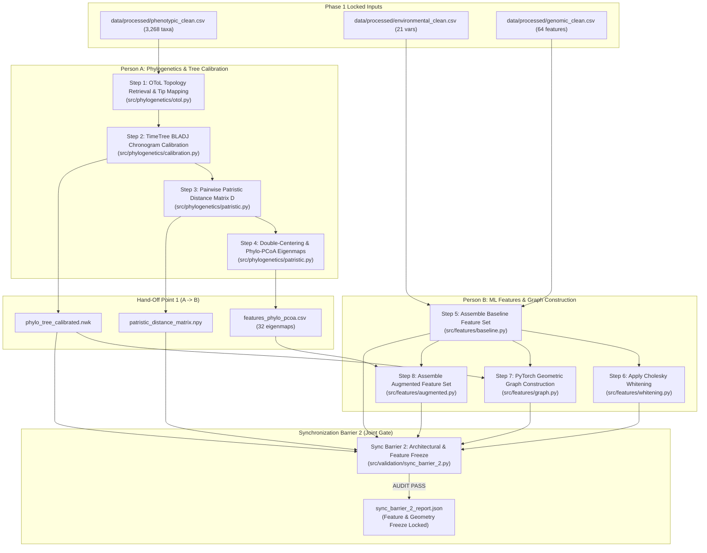

# PHENIX: Phase 2 Execution Guide & Operational Hand-Offs

**Phylogenetically Informed Machine Learning in Phenotypic Trait Prediction**  
**Phase 2: Tree Calibration, Evolutionary Geometries & Multimodal Feature Transformations**

---

## 1. Executive Summary

This guide outlines the strict sequential order of implementation and operational hand-offs between **Person A (Data & Phylogenetics Lead)** and **Person B (ML & Benchmarking Lead)** for **Phase 2**.

In Phase 1, the pipeline harmonized and locked **3,268 mammalian taxa** across 27 orders under **Sync Barrier 1**. In Phase 2, Person A builds and calibrates the evolutionary tree and computes phylogenetic distance eigenmaps, while Person B assembles baseline feature representations, applies Cholesky whitening, constructs graph representations for GNNs, and produces the augmented multimodal feature set.

Phase 2 culminates in **Synchronization Barrier 2 (Architectural & Feature Freeze)**, ensuring complete tip-to-feature alignment, positive semi-definite covariance properties, and zero missing values before modeling begins in Phase 3.

---

## 2. Implementation Order & Dependency Flow



---

## 3. Order of Implementation

### Sequential Task Order Summary

| Step | Owner | Task Name | Core Module | Output Artifact |
| :---: | :---: | :--- | :--- | :--- |
| **1** | **Person A** | OToL Consensus Topology & Tip Mapping | `src/phylogenetics/otol.py` | Parsed Tree with mapped leaves |
| **2** | **Person A** | Divergence Calibration (TimeTree BLADJ) | `src/phylogenetics/calibration.py` | `data/processed/phylo_tree_calibrated.nwk` |
| **3** | **Person A** | Patristic Evolutionary Distance Matrix $D$ | `src/phylogenetics/patristic.py` | `data/processed/patristic_distance_matrix.npy` |
| **4** | **Person A** | Double-Centering & Phylo-PCoA Eigenmaps | `src/phylogenetics/patristic.py` | `data/processed/features_phylo_pcoa.csv` |
| ⇄ | **HAND-OFF** | *Person A notifies Person B: Calibrated tree and Phylo-PCoA eigenmaps ready.* | | |
| **5** | **Person B** | Assemble Baseline Feature Set (Env + Gen) | `src/features/baseline.py` | `data/processed/features_baseline.csv` |
| **6** | **Person B** | Apply Cholesky Feature Whitening | `src/features/whitening.py` | `data/processed/features_whitened.csv` |
| **7** | **Person B** | Construct PyTorch Geometric Graph $G=(V, E)$ | `src/features/graph.py` | `data/processed/phylo_graph.json` |
| **8** | **Person B** | Assemble Augmented Feature Set | `src/features/augmented.py` | `data/processed/features_augmented.csv` |
| 🔒 | **SYNC 2** | **Execute Sync Barrier 2 Verification Gate** | `src/validation/sync_barrier_2.py` | `data/processed/sync_barrier_2_report.json` |

---

## 4. Person A Detailed Instructions (Phylogenetics Lead)

Person A is responsible for the evolutionary geometry: building the tree, calibrating divergence times against fossil and molecular clocks, and extracting continuous spatial phylogenetic eigenmaps.

### Step 1: Open Tree of Life (OToL) Consensus Topology
- **Input**: `data/processed/phenotypic_clean.csv` (uses `species_id` and `open_tree_id`).
- **Module**: `src/phylogenetics/otol.py`
- **Actions**:
  1. Retrieve mammalian consensus synthetic topology via the Open Tree of Life v3 API (or cached reference tree).
  2. Parse the Newick topology using `NewickParser`.
  3. Prune the tree to retain exclusively the **3,268 locked mammalian taxa**.
  4. Ensure every leaf label matches canonical `Genus_species` format exactly.

### Step 2: TimeTree Divergence Calibration (BLADJ)
- **Input**: Uncalibrated tree topology from Step 1.
- **Module**: `src/phylogenetics/calibration.py`
- **Actions**:
  1. Assign node age constraints based on TimeTree 5.0 consensus divergence dates:
     - Mammalia crown root: **177.0 Ma**
     - Theria (Metatheria–Eutheria split): **160.0 Ma**
     - Placentalia crown radiation: **66.0–100.0 Ma**
     - Major order crown divergences: Carnivora (53.0 Ma), Rodentia (62.0 Ma), Primates (65.0 Ma), Cetartiodactyla (55.0 Ma), Chiroptera (58.0 Ma).
  2. Execute the **BLADJ (Branch Length Adjuster)** algorithm:
     - Fix constrained internal nodes to their target ages.
     - Evenly distribute branch lengths along unconstrained path segments:
       $$d_{\text{segment}} = \frac{\text{Age}_{\text{parent}} - \text{Age}_{\text{child}}}{k}$$
     - Enforce ultrametricity: total root-to-tip path length for every leaf must equal exactly **177.0 Ma**.
  3. Export: `data/processed/phylo_tree_calibrated.nwk`.

### Step 3: Compute Patristic Distance Matrix $D$
- **Input**: `data/processed/phylo_tree_calibrated.nwk`.
- **Module**: `src/phylogenetics/patristic.py`
- **Actions**:
  1. For every pair of species $(i, j)$, calculate the sum of branch lengths connecting them:
     $$D_{ij} = d(i, \text{MRCA}(i, j)) + d(j, \text{MRCA}(i, j)) = 2 \cdot (\text{RootAge} - \text{Age}(\text{MRCA}(i, j)))$$
  2. Enforce mathematical properties:
     - Strict diagonal zeros: $D_{ii} = 0$.
     - Exact symmetry: $D_{ij} = D_{ji}$.
     - Non-negativity: $D_{ij} \ge 0$.
  3. Export: `data/processed/patristic_distance_matrix.npy` (shape $3,268 \times 3,268$).

### Step 4: Double-Centering & Phylo-PCoA Eigenmaps
- **Input**: Patristic distance matrix $D$.
- **Module**: `src/phylogenetics/patristic.py`
- **Actions**:
  1. Construct the centering matrix $H = I - \frac{1}{N}\mathbf{1}\mathbf{1}^T$.
  2. Compute the Gower double-centered inner-product matrix $B$:
     $$B = -\frac{1}{2} H (D^{\odot 2}) H$$
  3. Perform eigendecomposition $B = V \Lambda V^T$.
  4. Truncate to the top $k = 32$ positive eigenvalues and scale coordinates:
     $$X_{\text{pcoa}} = V_{:, 1:k} \Lambda_{1:k}^{1/2}$$
  5. Export: `data/processed/features_phylo_pcoa.csv` ($3,268 \times 32$ eigenmaps with `species_id` index).

**Milestone Hand-off**: Person A commits `phylo_tree_calibrated.nwk` and `features_phylo_pcoa.csv` and informs Person B.

---

## 5. Person B Detailed Instructions (ML & Benchmarking Lead)

Person B transforms environmental rasters and genomic embeddings into model-ready tensors, decorrelates features via Cholesky whitening, constructs graph representations for GNNs, and builds the augmented feature set.

### Step 5: Assemble Baseline Feature Set
- **Inputs**:
  - `data/processed/environmental_clean.csv` (21 bioclimatic and habitat variables).
  - `data/processed/genomic_clean.csv` (64 ESM-2, SNP, and functional genomic features).
- **Module**: `src/features/baseline.py`
- **Actions**:
  1. Merge tables on `species_id` (inner join, verified 3,268 species).
  2. Order rows alphabetically by `species_id` to guarantee alignment with phylogenetic matrices.
  3. Standardize numeric columns using Z-score normalization ($\mu = 0, \sigma = 1$).
  4. Export: `data/processed/features_baseline.csv` ($3,268 \times 85$ features).

### Step 6: Cholesky Whitening ($X^* = L^{-1} X$)
- **Input**: `data/processed/features_baseline.csv`.
- **Module**: `src/features/whitening.py`
- **Actions**:
  1. Compute empirical covariance matrix $\Sigma = \frac{1}{N-1} X^T X$.
  2. Add Tikhonov regularization $\epsilon I$ ($\epsilon = 10^{-5}$) to ensure strict positive-definiteness:
     $$\Sigma_{\text{reg}} = \Sigma + \epsilon I$$
  3. Perform lower-triangular Cholesky factorization:
     $$\Sigma_{\text{reg}} = L L^T$$
  4. Invert $L$ and transform feature coordinates:
     $$X^* = X (L^{-1})^T$$
  5. Verify that $\text{Cov}(X^*) \approx I_{85 \times 85}$.
  6. Export: `data/processed/features_whitened.csv`.

### Step 7: Construct PyTorch Geometric Tree Graph $G=(V, E)$
- **Inputs**: `phylo_tree_calibrated.nwk` and `features_baseline.csv`.
- **Module**: `src/features/graph.py`
- **Actions**:
  1. Traverse calibrated Newick tree to extract:
     - Node index mapping: 3,268 leaf nodes + ancestral internal nodes.
     - Edge index tensor ($2 \times |E|$) connecting parents and children.
     - Edge attributes: branch lengths (representing evolutionary divergence time in Ma).
  2. Associate leaf nodes with baseline feature vectors $x_i \in \mathbb{R}^{85}$.
  3. Export: `data/processed/phylo_graph.json`.

### Step 8: Assemble Phylogenetic-Augmented Feature Set
- **Inputs**: `features_baseline.csv` (85 dims) and `features_phylo_pcoa.csv` (32 dims).
- **Module**: `src/features/augmented.py`
- **Actions**:
  1. Align both matrices on `species_id`.
  2. Concatenate along the feature dimension:
     $$X_{\text{augmented}} = [X_{\text{baseline}} \mid X_{\text{phylo\_pcoa}}] \in \mathbb{R}^{3,268 \times 117}$$
  3. Verify 0 NaNs and complete row alignment.
  4. Export: `data/processed/features_augmented.csv`.

---

## 6. Synchronization Barrier 2 (Architectural & Feature Freeze)

Before moving to Phase 3, both leads jointly execute the Sync Barrier 2 audit gate:

```powershell
python -m src.validation.sync_barrier_2 --data-dir data/processed
```

### Automated Audit Criteria

| Audit Check | Acceptance Threshold | Description |
| :--- | :--- | :--- |
| **Taxa Integrity** | Exactly 3,268 species | All 5 feature matrices and the tree must contain the identical set of species. |
| **Tip-to-Row Match** | 100% 1-to-1 match | Every leaf in the Newick tree maps directly to a row in the feature matrices. |
| **Feature Dimensions** | Baseline: 85, Augmented: 117 | Exact column counts verified across all feature matrices. |
| **Missingness** | 0 NaNs, 0 Infs | Complete completeness check across all 117 features. |
| **Symmetry of $D$** | $\|D - D^T\|_{\max} < 10^{-10}$ | Patristic distance matrix must be strictly symmetric with zero diagonal. |
| **Whitening Check** | $\|\text{Cov}(X^*) - I\|_{\max} < 10^{-2}$ | Whitened features must have an empirical covariance close to the identity matrix. |
| **Graph Connectedness** | Single connected component | PyG graph must span all leaves and internal nodes without orphaned subtrees. |

**Audit Outcome**: Produces `data/processed/sync_barrier_2_report.json` with `"status": "PASS"`. Features and evolutionary geometry are locked.

---

## 7. Unified CLI Execution

To run the entire Phase 2 pipeline in a single automated pass:

```powershell
python -m src.pipeline_phase2 --data-dir data/processed
```

To run individual components:
```powershell
# Side A: Tree Calibration & PCoA
python -c "from src.phylogenetics import calibrate_tree_bladj, compute_phylo_pcoa_eigenmaps"

# Side B: Baseline & Whitening
python -c "from src.features import build_baseline_features, cholesky_whiten"

# Run automated test suite
python -m pytest tests/test_phylogenetics.py tests/test_features.py tests/test_sync_barrier_2.py -v
```

---

## 8. Transition to Phase 3: What Lies Ahead

Once Sync Barrier 2 is locked, the team proceeds directly to **Phase 3: Validation Engine & Model Engineering**:

- **Person A**:
  - Define **monophyletic taxonomic withholdings** (holding out entire clades such as *Rodentia*, *Chiroptera*, or *Carnivora*).
  - Define phylogenetic tree-cut depths ($T_{\text{cut}}$) and buffer exclusion zones to prevent boundary leakage.
- **Person B**:
  - Implement Random 10-Fold CV generator vs Phylogenetic Cross-Validation (Phylo-CV) engine.
  - Implement model pipelines: Ridge Regression, Random Forest, XGBoost, and PyTorch GNNs.
- **Sync Barrier 3**: Clade Leakage Audit (guaranteeing zero sister-taxa overlap in out-of-clade evaluation folds).
