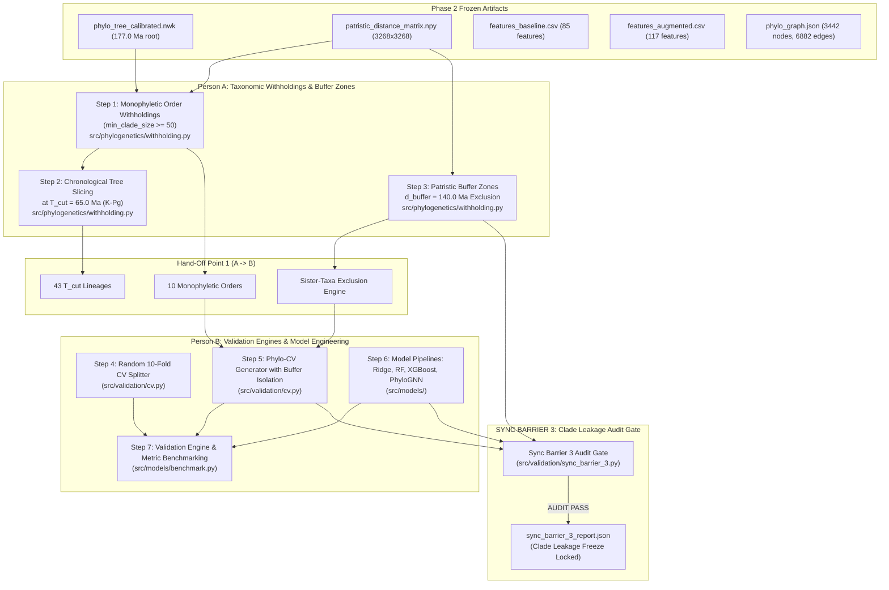

# PHENIX: Phase 3 Execution Guide & Operational Hand-Offs

**Phylogenetically Informed Machine Learning in Phenotypic Trait Prediction**  
**Phase 3: Validation Engine, Monophyletic Withholdings, Buffer Exclusion & Model Engineering**

---

## 1. Executive Summary

This guide outlines the strict sequential order of implementation and operational hand-offs between **Person A (Data & Phylogenetics Lead)** and **Person B (ML & Benchmarking Lead)** for **Phase 3**.

In Phase 1 and Phase 2, the pipeline harmonized **3,268 mammalian taxa**, calibrated an ultrametric timetree (root age 177.0 Ma), extracted 32 Phylo-PCoA eigenmaps, constructed baseline and augmented feature sets, and exported the PyTorch Geometric graph $G=(V, E)$.

In **Phase 3**, the team builds the macroevolutionary validation engine:
- **Person A** establishes monophyletic taxonomic withholdings, $T_{\text{cut}}$ chronological tree slices, and patristic distance buffer zones ($\mathcal{B}$) to prevent sister-taxa boundary leakage.
- **Person B** implements Random 10-Fold CV, the Phylogenetic Cross-Validation (**Phylo-CV**) generator, and 4 predictive model pipelines (**Ridge Regression**, **Random Forest**, **XGBoost**, and **PyG Graph Neural Network**).

Phase 3 culminates in **Synchronization Barrier 3 (Clade Leakage Audit Gate)**, guaranteeing zero taxonomic and boundary leakage between training and evaluation folds before benchmarking begins in Phase 4.

---

## 2. Implementation Order & Dependency Flow



---

## 3. Order of Implementation

### Sequential Task Order Summary

| Step | Lead | Task Name | Module | Primary Output / Verification |
| :---: | :---: | :--- | :--- | :--- |
| **1** | **Person A** | Monophyletic Order Withholdings | `src/phylogenetics/withholding.py` | 10 major mammalian orders ($N \ge 50$) |
| **2** | **Person A** | Chronological Tree-Cut ($T_{\text{cut}}$) | `src/phylogenetics/withholding.py` | 43 monophyletic lineages ($T_{\text{cut}} = 65.0$ Ma) |
| **3** | **Person A** | Patristic Buffer Quarantine ($\mathcal{B}$) | `src/phylogenetics/withholding.py` | Strict exclusion of taxa within $d_{\text{buffer}} < 140.0$ Ma |
| **4** | **Person B** | Random 10-Fold CV Splitter | `src/validation/cv.py` | `data/processed/cv_random_folds.json` |
| **5** | **Person B** | Phylogenetic Cross-Validation | `src/validation/cv.py` | `data/processed/cv_phylo_folds.json` |
| **6** | **Person B** | Model Pipelines (Ridge, RF, XGB, GNN) | `src/models/` | Unified `PhenixModel` interface |
| **7** | **Person B** | Validation Engine & Out-of-Fold Logging | `src/models/benchmark.py` | Fold-level and aggregated metrics ($R^2$, RMSE, MAE) |
| **8** | **Joint** | Sync Barrier 3 Clade Leakage Audit | `src/validation/sync_barrier_3.py` | `data/processed/sync_barrier_3_report.json` (**PASS**) |

---

## 4. Mathematical & Algorithmic Specifications

### 1. Monophyletic Withholding & MRCA Validation
A candidate evaluation set $C_{\text{test}} \subset \mathcal{X}$ is verified as monophyletic on calibrated tree $T$ if and only if the set of leaf descendants of its Most Recent Common Ancestor equals $C_{\text{test}}$:
$$\text{Leaves}(\text{MRCA}(C_{\text{test}})) = C_{\text{test}}$$

### 2. Chronological Tree Slicing ($T_{\text{cut}}$)
Given root age $H = 177.0$ Ma and cut depth $T_{\text{cut}} = 65.0$ Ma (the Cretaceous-Paleogene boundary):
- For every node $u$ such that $\text{age}(\text{parent}(u)) > T_{\text{cut}}$ and $\text{age}(u) \le T_{\text{cut}}$, all leaf descendants $\text{Leaves}(u)$ form a monophyletic partition block.
- Every extant species leaf belongs to exactly one cluster, covering all 3,268 species with zero disjoint gaps.

### 3. Patristic Distance Buffer Quarantine
When evaluating generalization on held-out clade $C_{\text{test}}$, any taxon $s \notin C_{\text{test}}$ whose minimum patristic distance to the test clade is below $d_{\text{buffer}}$ is quarantined:
$$\mathcal{B}(C_{\text{test}}, d_{\text{buffer}}) = \left\{ s \in \mathcal{X} \setminus C_{\text{test}} \;\middle|\; \min_{t \in C_{\text{test}}} D(s, t) < d_{\text{buffer}} \right\}$$
The training set is strictly:
$$\text{Train}_{\text{clean}} = \mathcal{X} \setminus \left( C_{\text{test}} \cup \mathcal{B}(C_{\text{test}}, d_{\text{buffer}}) \right)$$
Guarantees:
$$\forall s \in \text{Train}_{\text{clean}},\; \forall t \in C_{\text{test}}:\quad D(s, t) \ge d_{\text{buffer}}$$

### 4. Predictive Architectures
1. **Ridge Regression**: L2-regularized linear baseline with standardized features and $\alpha$ cross-validation:
   $$\min_{\beta} \|y - X\beta\|_2^2 + \alpha \|\beta\|_2^2$$
2. **Random Forest**: Non-linear tree ensemble capturing feature interactions with 100 estimators.
3. **XGBoost**: Gradient boosted regression trees with second-order gradient optimization.
4. **PhyloGNN (PyG)**: Graph convolutional network on calibrated phylogenetic tree $G=(V, E)$:
   $$h_u^{(l+1)} = \sigma \left( \sum_{v \in \mathcal{N}(u) \cup \{u\}} w_{uv} \cdot W^{(l)} h_v^{(l)} \right)$$
   where branch-length weights $w_{uv} = \exp(-l_{uv} / \tau)$.

---

## 5. CLI Commands & Execution

### Run Full Phase 3 Pipeline
```powershell
python -m src.pipeline_phase3 --data-dir data/processed --d-buffer 140.0 --min-clade-size 50
```

### Run Sync Barrier 3 Standalone Audit Gate
```powershell
python -m src.validation.sync_barrier_3 --data-dir data/processed --d-buffer 140.0
```

### Run Complete Test Suite
```powershell
python -m pytest -v
```

---

## 6. Audit Checklist for Sync Barrier 3

- [x] **File Integrity**: All Phase 1, Phase 2, and Phase 3 artifacts exist.
- [x] **Disjointness**: $\text{Train} \cap \text{Test} = \emptyset$, $\text{Train} \cap \mathcal{B} = \emptyset$, $\text{Test} \cap \mathcal{B} = \emptyset$ for all folds.
- [x] **Completeness**: $\text{Train} \cup \text{Test} \cup \mathcal{B} = \text{Total Species}$ (3,268 taxa).
- [x] **Buffer Isolation**: Zero buffer violations ($\min_{t \in \text{Test}} D(s, t) \ge d_{\text{buffer}}$ for all $s \in \text{Train}$).
- [x] **Monophyly**: All 10 major mammalian orders verified as monophyletic.
- [x] **Model Execution**: All 4 model families (Ridge, RF, XGBoost, PhyloGNN) train and predict with finite metrics.
- [x] **Status Lock**: `sync_barrier_3_report.json` locked with `STATUS: PASS`.
