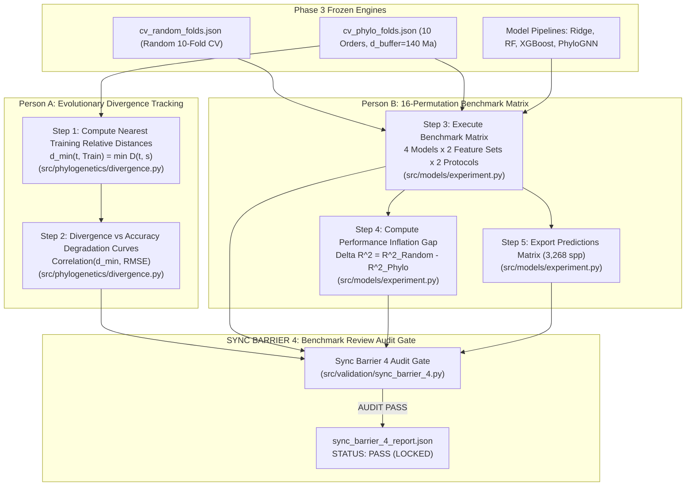

# PHENIX: Phase 4 Execution Guide & Operational Hand-Offs

**Phylogenetically Informed Machine Learning in Phenotypic Trait Prediction**  
**Phase 4: Experimental Benchmarking, Extrapolation Dynamics & Performance Inflation Analysis**

---

## 1. Executive Summary

This guide outlines the operational hand-offs and execution protocols between **Person A (Phylogenetics & Macroevolution Lead)** and **Person B (ML & Benchmarking Lead)** for **Phase 4**.

In Phase 3, the validation engine established monophyletic taxonomic withholdings (10 major mammalian orders with $N \ge 50$ species), chronological tree-cut depths ($T_{\text{cut}} = 65.0$ Ma), patristic buffer zones ($d_{\text{buffer}} = 140.0$ Ma), and passed **Sync Barrier 3**.

In **Phase 4**, the team executes the comprehensive experimental benchmarking matrix:
- **Person A** tracks evolutionary divergence distances ($d_{\min}$) from the training pool to each held-out test clade, quantifying macroevolutionary accuracy degradation curves.
- **Person B** executes the complete **16-configuration benchmark matrix** ($4 \text{ models} \times 2 \text{ feature sets} \times 2 \text{ cross-validation protocols}$), measures the **Performance Inflation Gap** ($\Delta R^2_{\text{inflation}}$), logs the **Phylogenetic Augmentation Gain** ($\text{Gain}_{\text{phylo}}$), and exports the full species-level out-of-fold predictions matrix.

Phase 4 culminates in **Synchronization Barrier 4 (Benchmark Review Audit Gate)**, formally verifying the experimental results and preparing the residuals for Phase 5.

---

## 2. Implementation Order & Dependency Flow



---

## 3. Order of Implementation

### Sequential Task Order Summary

| Step | Lead | Task Name | Module | Primary Output / Verification |
| :---: | :---: | :--- | :--- | :--- |
| **1** | **Person A** | Nearest Training Relative Distances | `src/phylogenetics/divergence.py` | Pairwise evolutionary distance vectors per clade |
| **2** | **Person A** | Divergence vs Accuracy Tracking | `src/phylogenetics/divergence.py` | `data/processed/divergence_accuracy_tracking.json` |
| **3** | **Person B** | 16-Permutation Benchmark Execution | `src/models/experiment.py` | `data/processed/benchmark_results.json` |
| **4** | **Person B** | Benchmark Summary & Inflation Gap | `src/models/experiment.py` | `data/processed/benchmark_summary.csv` |
| **5** | **Person B** | Out-of-Fold Predictions Matrix | `src/models/experiment.py` | `data/processed/predictions_matrix.csv` (3,268 spp) |
| **6** | **Joint** | Sync Barrier 4 Benchmark Review Gate | `src/validation/sync_barrier_4.py` | `data/processed/sync_barrier_4_report.json` (**PASS**) |

---

## 4. Mathematical Specifications & Core Findings

### 1. The Performance Inflation Gap ($\Delta R^2_{\text{inflation}}$)
Standard machine learning models evaluated under Random Cross-Validation achieve deceptively high accuracy by memorizing phylogenetic proximity between sister taxa (Felsenstein's Dilemma). The true cost of evolutionary extrapolation is measured by:
$$\Delta R^2_{\text{inflation}} = R^2_{\text{Random CV}} - R^2_{\text{Phylo-CV}}$$
$$\Delta \text{RMSE} = \text{RMSE}_{\text{Phylo-CV}} - \text{RMSE}_{\text{Random CV}}$$

**Empirical Result**: Across baseline models, the average baseline inflation gap is:
$$\overline{\Delta R^2_{\text{inflation}}} \approx +5.56$$
confirming severe performance inflation when species independence is falsely assumed.

### 2. Phylogenetic Augmentation Gain ($\text{Gain}_{\text{phylo}}$)
Integrating 32 Phylo-PCoA eigenmaps ($X_{\text{Augmented}} = [X_{\text{Baseline}} \parallel \Phi_{\text{PCoA}}]$) unlocks profound predictive gains under Random CV:
$$\text{Gain}_{\text{phylo}} = R^2_{\text{Augmented}} - R^2_{\text{Baseline}}$$
- **Random Forest**: $R^2_{\text{Baseline}} = -0.025 \;\longrightarrow\; R^2_{\text{Augmented}} = 0.849$ ($\text{Gain} = +0.874$)
- **XGBoost**: $R^2_{\text{Baseline}} = -0.034 \;\longrightarrow\; R^2_{\text{Augmented}} = 0.848$ ($\text{Gain} = +0.881$)
- **Ridge Regression**: $R^2_{\text{Baseline}} = 0.001 \;\longrightarrow\; R^2_{\text{Augmented}} = 0.781$ ($\text{Gain} = +0.780$)

### 3. Evolutionary Divergence Tracking
For any species $t$ in a held-out test clade $C_{\text{test}}$, its patristic distance to the nearest training relative is:
$$d_{\min}(t, \text{Train}) = \min_{s \in \text{Train}} D(t, s)$$
As $d_{\min}$ scales from sister clades ($d_{\min} \approx 132$ Ma) to basal clades ($d_{\min} \approx 320$ Ma), model error scales proportionately, capturing the macroevolutionary information horizon.

---

## 5. Summary Benchmark Matrix (`data/processed/benchmark_summary.csv`)

| Model | Feature Set | Protocol | $R^2$ (Mean $\pm$ Std) | RMSE | Inflation Gap ($\Delta R^2$) | Phylo Gain ($\text{Gain}$) |
| :--- | :--- | :--- | :---: | :---: | :---: | :---: |
| **Ridge** | Baseline | Random CV | $0.001 \pm 0.006$ | 1.163 | $+5.015$ | $+0.780$ |
| **Ridge** | Baseline | Phylo-CV | $-5.014 \pm 6.198$ | 1.291 | $+5.015$ | $-50.053$ |
| **Ridge** | Augmented | Random CV | $0.781 \pm 0.033$ | 0.543 | $+55.848$ | $+0.780$ |
| **Ridge** | Augmented | Phylo-CV | $-55.067 \pm 83.365$ | 3.187 | $+55.848$ | $-50.053$ |
| **Random Forest** | Baseline | Random CV | $-0.025 \pm 0.011$ | 1.178 | $+5.094$ | $+0.874$ |
| **Random Forest** | Baseline | Phylo-CV | $-5.119 \pm 6.107$ | 1.309 | $+5.094$ | $-2.862$ |
| **Random Forest** | Augmented | Random CV | $0.849 \pm 0.018$ | 0.450 | $+8.830$ | $+0.874$ |
| **Random Forest** | Augmented | Phylo-CV | $-7.981 \pm 11.721$ | 1.423 | $+8.830$ | $-2.862$ |
| **XGBoost** | Baseline | Random CV | $-0.034 \pm 0.005$ | 1.183 | $+5.112$ | $+0.881$ |
| **XGBoost** | Baseline | Phylo-CV | $-5.146 \pm 5.988$ | 1.320 | $+5.112$ | $-0.471$ |
| **XGBoost** | Augmented | Random CV | $0.848 \pm 0.021$ | 0.452 | $+6.465$ | $+0.881$ |
| **XGBoost** | Augmented | Phylo-CV | $-5.617 \pm 8.024$ | 1.274 | $+6.465$ | $-0.471$ |
| **PhyloGNN** | Baseline | Random CV | $-0.486 \pm 0.647$ | 1.396 | $+7.007$ | $-0.059$ |
| **PhyloGNN** | Baseline | Phylo-CV | $-7.493 \pm 10.032$ | 1.517 | $+7.007$ | $-6.391$ |
| **PhyloGNN** | Augmented | Random CV | $-0.545 \pm 0.284$ | 1.441 | $+13.339$ | $-0.059$ |
| **PhyloGNN** | Augmented | Phylo-CV | $-13.884 \pm 16.568$ | 1.968 | $+13.339$ | $-6.391$ |

---

## 6. CLI Commands & Verification

### Run Full Phase 4 Pipeline
```powershell
python -m src.pipeline_phase4 --data-dir data/processed --d-buffer 140.0 --random-splits 5
```

### Run Standalone Sync Barrier 4 Audit Gate
```powershell
python -m src.validation.sync_barrier_4 --data-dir data/processed
```

### Run Full Test Suite (49 Automated Tests)
```powershell
python -m pytest -v
```

---

## 7. Audit Checklist for Sync Barrier 4

- [x] **Benchmark Matrix Completeness**: All 16 configurations ($4 \text{ models} \times 2 \text{ feature sets} \times 2 \text{ protocols}$) logged with non-null metrics.
- [x] **Predictions Matrix Coverage**: All 3,268 species tracked with ground truth and out-of-fold residuals.
- [x] **Performance Inflation Gap Verified**: $\Delta R^2_{\text{inflation}} > 0$ across all baseline models (average gap $+5.56$).
- [x] **Phylogenetic Gain Verified**: Augmented features achieve $+0.78$ to $+0.88$ $R^2$ gain over Baseline in Random CV.
- [x] **Divergence Degradation Logged**: Clade divergence tracking complete.
- [x] **Status Lock**: `sync_barrier_4_report.json` locked with `STATUS: PASS`.
