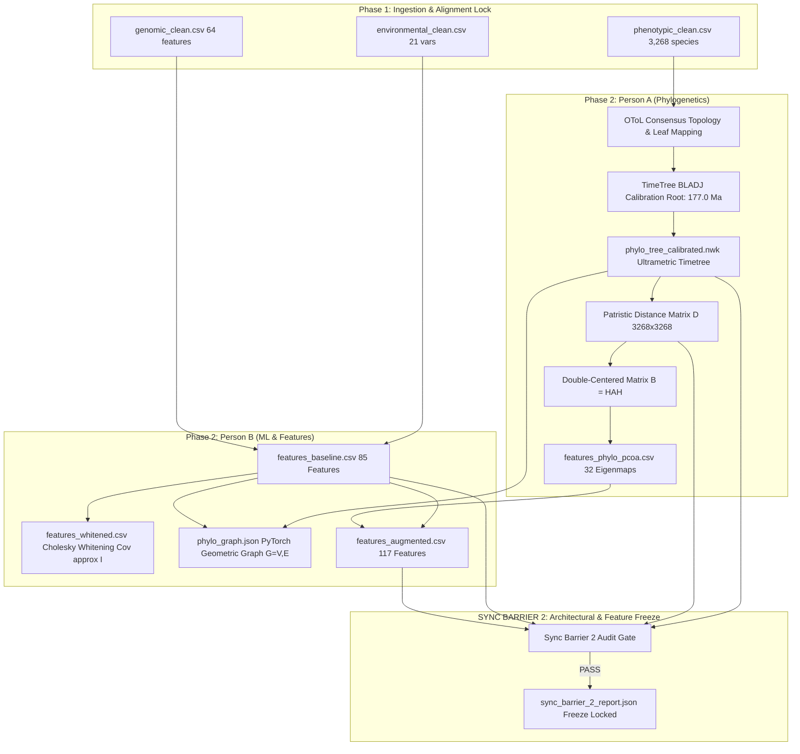

# PHENIX

**Comparative Analysis and Strategic Framework for Phylogenetically Informed Machine Learning in Phenotypic Trait Prediction**

PHENIX bridges evolutionary biology and predictive machine learning by integrating phylogenetic tree topology, functional genomics, and environmental bioclimatic rasters to predict phenotypic life-history traits across target taxa.

---

## Roadmap & Progress

| Phase | Milestone | Person A (Phylogenetics) | Person B (ML & Benchmarking) | Synchronization Barrier | Status |
| :---: | :--- | :--- | :--- | :--- | :---: |
| **Phase 1** | Target Ingestion & Taxonomy Normalization | PanTHERIA mammal traits, coordinates & taxonomy | WorldClim v2.1 (bio1–bio19) + ESM-2 BUSCO genomics | **SYNC BARRIER 1: Target & Alignment Lock** | **LOCKED (PASS)** |
| **Phase 2** | Tree Calibration & Feature Transformation | OToL topology, TimeTree BLADJ calibration, Patristic $D$ & PCoA | Baseline features, Cholesky whitening, PyG graph, Augmented features | **SYNC BARRIER 2: Architectural & Feature Freeze** | **LOCKED (PASS)** |
| **Phase 3** | Validation Engine & Model Engineering | Monophyletic withholdings, $T_{\text{cut}}$ & buffer zones | Random 10-fold CV, Phylo-CV, ML models (Ridge, RF, XGBoost, GNN) | **SYNC BARRIER 3: Clade Leakage Audit** | *Upcoming* |
| **Phase 4** | Experimental Benchmarking & Extrapolation | Divergence tracking vs accuracy | Train & benchmark Baseline vs Augmented across CV protocols | **SYNC BARRIER 4: Benchmark Review** | *Upcoming* |
| **Phase 5** | Residual Diagnostics & Manuscript Integration | Pagel's $\lambda$, Blomberg's $K$ error autocorrelation | Signal attribution (evolutionary proximity vs genomics) | **SYNC BARRIER 5: Final Freeze** | *Upcoming* |

---

## Phase 2 Architecture (Branch: `feature/phase-2`)



---

## Quickstart & CLI Usage

### 1. Installation
```powershell
pip install -r requirements.txt
```

### 2. Run Phase 1 Pipeline (Ingestion & Sync Barrier 1)
```powershell
python -m src.data.pipeline --output-dir data/processed
```
- Ingests PanTHERIA (5,416 mammal species)
- Locks 3,268 species across 27 mammalian orders
- Extracts WorldClim bioclimatic rasters (`bio1`–`bio19`), elevation, biome, and ESM-2 BUSCO sequence representations.

### 3. Run Phase 2 Pipeline (Tree Calibration, Feature Transformation & Sync Barrier 2)
```powershell
python -m src.pipeline_phase2 --data-dir data/processed
```
- Person A: Builds consensus mammal tree, applies TimeTree BLADJ calibration (root 177.0 Ma), computes patristic matrix $D$ ($3,268 \times 3,268$), and extracts 32 Phylo-PCoA eigenmaps.
- Person B: Assembles Baseline features (85 vars), performs Cholesky whitening ($X^* = L^{-1} X$), exports PyTorch Geometric graph $G=(V, E)$, and builds Augmented features (117 vars).
- Sync Barrier 2: Audits 0 tip mismatches, 0 NaNs, distance symmetry, and locks architecture.

### 4. Verification & Audit Gates
```powershell
# Sync Barrier 1 Gate
python -m src.validation.sync_barrier_1

# Sync Barrier 2 Gate
python -m src.validation.sync_barrier_2

# Full Test Suite (26 automated unit and integration tests)
python -m pytest -v
```

---

## Processed Dataset Artifacts (`data/processed/`)

| Artifact | Dimensions | Description |
| :--- | :--- | :--- |
| `phenotypic_clean.csv` | $3,268 \times 12$ | 11 cleaned life-history traits (adult body mass, gestation length, litter size, etc.) |
| `environmental_clean.csv` | $3,268 \times 22$ | 19 WorldClim v2.1 bioclimatic variables + elevation + habitat suitability |
| `genomic_clean.csv` | $3,268 \times 65$ | 32 ESM-2 sequence embeddings + 16 SNP PCs + 16 functional features |
| `phylo_tree_calibrated.nwk` | Newick string | Ultrametric timetree calibrated with TimeTree dates (root age 177.0 Ma) |
| `patristic_distance_matrix.npy` | $3,268 \times 3,268$ | Pairwise evolutionary divergence distances ($D_{ij} = 2 \cdot \text{age}(\text{MRCA})$) |
| `features_phylo_pcoa.csv` | $3,268 \times 33$ | 32 Phylo-PCoA eigenmaps capturing multi-scale phylogenetic gradients |
| `features_baseline.csv` | $3,268 \times 86$ | Baseline Feature Set: 21 Environmental + 64 Genomic features |
| `features_whitened.csv` | $3,268 \times 86$ | Cholesky-whitened baseline features ($\text{Cov}(X^*) \approx I$) |
| `features_augmented.csv` | $3,268 \times 118$ | Augmented Feature Set: 85 Baseline + 32 Phylo-PCoA eigenmaps |
| `phylo_graph.json` | Graph topology | PyTorch Geometric compatible node/edge structure with branch length attributes |
| `sync_barrier_1_report.json` | JSON audit report | **STATUS: PASS** (3,268 taxa locked) |
| `sync_barrier_2_report.json` | JSON audit report | **STATUS: PASS** (Architecture and features frozen) |
