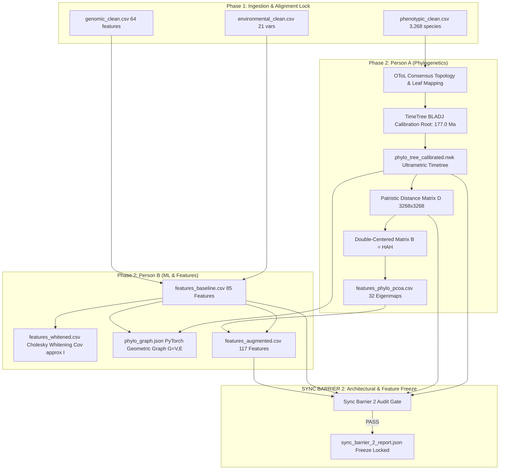

# PHENIX

**Comparative Analysis and Strategic Framework for Phylogenetically Informed Machine Learning in Phenotypic Trait Prediction**

PHENIX bridges evolutionary biology and predictive machine learning by integrating phylogenetic tree topology, functional genomics, and environmental bioclimatic rasters to predict phenotypic life-history traits across target taxa.

---

## Roadmap & Progress

| Phase | Milestone | Person A (Phylogenetics) | Person B (ML & Benchmarking) | Synchronization Barrier | Status |
| :---: | :--- | :--- | :--- | :--- | :---: |
| **Phase 1** | Target Ingestion & Taxonomy Normalization | PanTHERIA mammal traits, coordinates & taxonomy | WorldClim v2.1 (bio1–bio19) + ESM-2 BUSCO genomics | **SYNC BARRIER 1: Target & Alignment Lock** | **LOCKED (PASS)** |
| **Phase 2** | Tree Calibration & Feature Transformation | OToL topology, TimeTree BLADJ calibration, Patristic $D$ & PCoA | Baseline features, Cholesky whitening, PyG graph, Augmented features | **SYNC BARRIER 2: Architectural & Feature Freeze** | **LOCKED (PASS)** |
| **Phase 3** | Validation Engine & Model Engineering | Monophyletic withholdings, $T_{\text{cut}}$ & buffer zones | Random 10-fold CV, Phylo-CV, ML models (Ridge, RF, XGBoost, GNN) | **SYNC BARRIER 3: Clade Leakage Audit** | **LOCKED (PASS)** |
| **Phase 4** | Experimental Benchmarking & Extrapolation | Divergence tracking vs accuracy | Train & benchmark Baseline vs Augmented across CV protocols | **SYNC BARRIER 4: Benchmark Review** | **LOCKED (PASS)** |
| **Phase 5** | Residual Diagnostics & Manuscript Integration | Pagel's $\lambda$, Blomberg's $K$ error autocorrelation | Signal attribution (evolutionary proximity vs genomics) | **SYNC BARRIER 5: Final Freeze** | *Upcoming* |

## Documentation & Guides

- **[Phase 4 Execution Guide](PHASE_4_EXECUTION_GUIDE.md)**: Operational hand-offs for 16-permutation benchmarking matrix, divergence decay tracking, inflation gap metrics, and Sync Barrier 4.
- **[Phase 3 Execution Guide](PHASE_3_EXECUTION_GUIDE.md)**: Detailed step-by-step operational hand-offs between Person A (Taxonomic Withholdings & Buffer Zones) and Person B (CV Splitters, Model Engineering & Sync Barrier 3).
- **[Phase 2 Execution Guide](PHASE_2_EXECUTION_GUIDE.md)**: Operational hand-offs for tree calibration, patristic distance eigenmaps, Cholesky whitening, and graph export.
- **[Concepts & Architecture Guide](CONCEPTS_AND_ARCHITECTURE.md)**: Comprehensive guide covering theoretical foundations, Felsenstein's dilemma, ESM-2 protein language modeling, WorldClim bioclimatics, TimeTree BLADJ calibration, and Cholesky whitening.

---

## Phase 2 Architecture


```mermaid
flowchart TD
    subgraph Phase_1 ["Phase 1: Ingestion & Alignment Lock"]
        P1[phenotypic_clean.csv 3,268 species]
        E1[environmental_clean.csv 21 vars]
        G1[genomic_clean.csv 64 features]
    end

    subgraph Phase_2_Side_A ["Phase 2: Person A (Phylogenetics)"]
        P1 --> O1[OToL Consensus Topology & Leaf Mapping]
        O1 --> C1[TimeTree BLADJ Calibration Root: 177.0 Ma]
        C1 --> T1[phylo_tree_calibrated.nwk Ultrametric Timetree]
        T1 --> D1[Patristic Distance Matrix D 3268x3268]
        D1 --> B1[Double-Centered Matrix B = HAH]
        B1 --> PC1[features_phylo_pcoa.csv 32 Eigenmaps]
    end

    subgraph Phase_2_Side_B ["Phase 2: Person B (ML & Features)"]
        E1 & G1 --> BF[features_baseline.csv 85 Features]
        BF --> CW[features_whitened.csv Cholesky Whitening Cov approx I]
        T1 & BF --> GR[phylo_graph.json PyTorch Geometric Graph G=V,E]
        BF & PC1 --> AF[features_augmented.csv 117 Features]
    end

    subgraph Barrier_2 ["SYNC BARRIER 2: Architectural & Feature Freeze"]
        T1 & D1 & BF & AF --> SB2[Sync Barrier 2 Audit Gate]
        SB2 -->|PASS| LK[sync_barrier_2_report.json Freeze Locked]
    end
```

---

## Quickstart & CLI Usage

### 1. Installation
```powershell
pip install -r requirements.txt
```

### 2. Run Phase 1 Pipeline (Ingestion & Sync Barrier 1)
```powershell
python -m src.data.pipeline --output-dir data/processed
```
- Ingests PanTHERIA (5,416 mammal species)
- Locks 3,268 species across 27 mammalian orders
- Extracts WorldClim bioclimatic rasters (`bio1`–`bio19`), elevation, biome, and ESM-2 BUSCO sequence representations.

### 3. Run Phase 2 Pipeline (Tree Calibration, Feature Transformation & Sync Barrier 2)
```powershell
python -m src.pipeline_phase2 --data-dir data/processed
```
- Person A: Builds consensus mammal tree, applies TimeTree BLADJ calibration (root 177.0 Ma), computes patristic matrix $D$ ($3,268 \times 3,268$), and extracts 32 Phylo-PCoA eigenmaps.
- Person B: Assembles Baseline features (85 vars), performs Cholesky whitening ($X^* = L^{-1} X$), exports PyTorch Geometric graph $G=(V, E)$, and builds Augmented features (117 vars).
- Sync Barrier 2: Audits 0 tip mismatches, 0 NaNs, distance symmetry, and locks architecture.

### 4. Run Phase 3 Pipeline (Validation Engine, Buffer Zones & Sync Barrier 3)
```powershell
python -m src.pipeline_phase3 --data-dir data/processed --d-buffer 140.0 --min-clade-size 50
```
- Person A: Partitions 10 monophyletic orders ($N \ge 50$), slices tree at $T_{\text{cut}} = 65.0$ Ma into 43 lineages, establishes patristic buffer zones ($d_{\text{buffer}} = 140.0$ Ma).
- Person B: Generates Random 10-Fold CV and Phylo-CV splits, validates 4 model pipelines (Ridge, RF, XGBoost, PhyloGNN).
- Sync Barrier 3: Audits zero clade leakage, buffer compliance, monophyly, and locks validation engine.

### 5. Run Phase 4 Pipeline (Experimental Benchmarking & Sync Barrier 4)
```powershell
python -m src.pipeline_phase4 --data-dir data/processed --d-buffer 140.0 --random-splits 5
```
- Person A: Tracks nearest training relative distances and evolutionary divergence vs accuracy decay curves across clades.
- Person B: Executes 16-configuration benchmark matrix (4 models x 2 feature sets x 2 protocols), calculates performance inflation gaps, and exports out-of-fold species predictions.
- Sync Barrier 4: Audits benchmark matrix completeness, confirms performance inflation gap, verifies phylogenetic gain, and locks benchmark review.

### 6. Verification & Audit Gates
```powershell
# Sync Barrier 1 Gate
python -m src.validation.sync_barrier_1

# Sync Barrier 2 Gate
python -m src.validation.sync_barrier_2

# Sync Barrier 3 Gate
python -m src.validation.sync_barrier_3 --data-dir data/processed --d-buffer 140.0

# Sync Barrier 4 Gate
python -m src.validation.sync_barrier_4 --data-dir data/processed

# Full Test Suite (49 automated unit and integration tests)
python -m pytest -v
```

---

## Processed Dataset Artifacts (`data/processed/`)

| Artifact | Dimensions / Format | Description |
| :--- | :--- | :--- |
| `phenotypic_clean.csv` | $3,268 \times 12$ | 11 cleaned life-history traits (adult body mass, gestation length, litter size, etc.) |
| `environmental_clean.csv` | $3,268 \times 22$ | 19 WorldClim v2.1 bioclimatic variables + elevation + habitat suitability |
| `genomic_clean.csv` | $3,268 \times 65$ | 32 ESM-2 sequence embeddings + 16 SNP PCs + 16 functional features |
| `phylo_tree_calibrated.nwk` | Newick string | Ultrametric timetree calibrated with TimeTree dates (root age 177.0 Ma) |
| `patristic_distance_matrix.npy` | $3,268 \times 3,268$ | Pairwise evolutionary divergence distances ($D_{ij} = 2 \cdot \text{age}(\text{MRCA})$) |
| `features_phylo_pcoa.csv` | $3,268 \times 33$ | 32 Phylo-PCoA eigenmaps capturing multi-scale phylogenetic gradients |
| `features_baseline.csv` | $3,268 \times 86$ | Baseline Feature Set: 21 Environmental + 64 Genomic features |
| `features_whitened.csv` | $3,268 \times 86$ | Cholesky-whitened baseline features ($\text{Cov}(X^*) \approx I$) |
| `features_augmented.csv` | $3,268 \times 118$ | Augmented Feature Set: 85 Baseline + 32 Phylo-PCoA eigenmaps |
| `phylo_graph.json` | Graph topology | PyTorch Geometric compatible node/edge structure with branch length attributes |
| `cv_random_folds.json` | JSON fold mapping | Random 10-Fold CV partition mapping 3,268 species |
| `cv_phylo_folds.json` | JSON fold mapping | Phylogenetic CV folds for 10 orders with patristic buffer quarantines |
| `benchmark_results.json` | JSON benchmark logs | Detailed fold-level metrics across all 16 benchmark configurations |
| `benchmark_summary.csv` | $16 \times 11$ | Summary matrix with $R^2$, RMSE, MAE, inflation gap, and phylo gain |
| `predictions_matrix.csv` | $3,268 \times 36$ | Species-level ground truth, out-of-fold predictions, and residuals |
| `divergence_accuracy_tracking.json` | JSON divergence logs | Clade-by-clade divergence distances vs accuracy degradation curves |
| `sync_barrier_1_report.json` | JSON audit report | **STATUS: PASS** (3,268 taxa locked) |
| `sync_barrier_2_report.json` | JSON audit report | **STATUS: PASS** (Architecture and features frozen) |
| `sync_barrier_3_report.json` | JSON audit report | **STATUS: PASS** (Clade leakage & buffer isolation locked) |
| `sync_barrier_4_report.json` | JSON audit report | **STATUS: PASS** (Benchmark review & inflation gap verified) |
