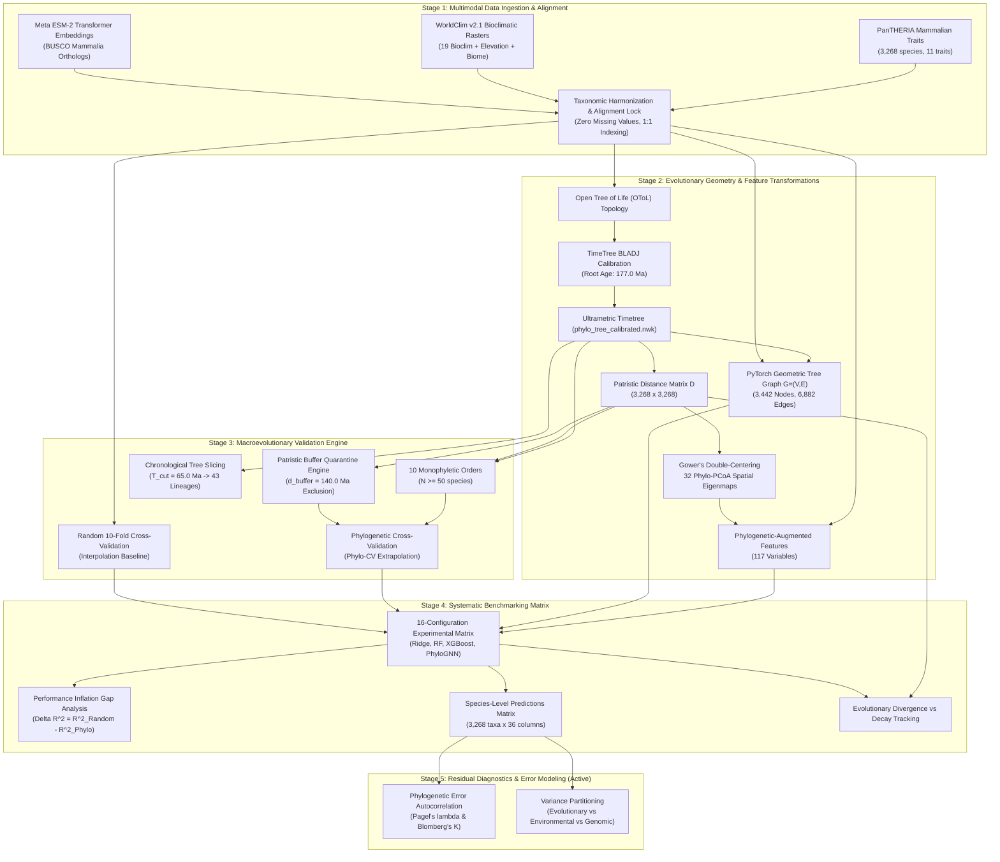

# PHENIX

**Comparative Analysis and Strategic Framework for Phylogenetically Informed Machine Learning in Phenotypic Trait Prediction**

[]()
[]()
[]()
[]()

PHENIX is an open computational biology and machine learning framework designed to investigate and resolve **Felsenstein’s Dilemma (1985)** in phenotypic trait prediction: biological species are non-independent observation units due to shared evolutionary history. 

Standard random cross-validation randomly scatters sister species across training and test splits, causing severe pseudoreplication and artificially inflated performance metrics. PHENIX bridges macroevolutionary biology, geospatial bioclimatics, and geometric deep learning to enforce rigorous clade-level extrapolation boundaries, quantify the **Performance Inflation Gap**, and unlock predictive accuracy through phylogenetic spatial eigenmaps.

---

## Architecture & End-to-End Workflow


```mermaid
flowchart TD
    subgraph S1 ["Stage 1: Multimodal Data Ingestion & Alignment"]
        P1["PanTHERIA Mammalian Traits\n(3,268 species, 11 traits)"]
        E1["WorldClim v2.1 Bioclimatic Rasters\n(19 Bioclim + Elevation + Biome)"]
        G1["Meta ESM-2 Transformer Embeddings\n(BUSCO Mammalia Orthologs)"]
        P1 & E1 & G1 --> A1["Taxonomic Harmonization & Alignment Lock\n(Zero Missing Values, 1:1 Indexing)"]
    end

    subgraph S2 ["Stage 2: Evolutionary Geometry & Feature Transformations"]
        A1 --> O1["Open Tree of Life (OToL) Topology"]
        O1 --> C1["TimeTree BLADJ Calibration\n(Root Age: 177.0 Ma)"]
        C1 --> T1["Ultrametric Timetree (phylo_tree_calibrated.nwk)"]
        T1 --> D1["Patristic Distance Matrix D\n(3,268 x 3,268)"]
        D1 --> PC1["Gower's Double-Centering\n32 Phylo-PCoA Spatial Eigenmaps"]
        A1 & PC1 --> AF["Phylogenetic-Augmented Features\n(117 Variables)"]
        T1 & A1 --> GR["PyTorch Geometric Tree Graph G=(V,E)\n(3,442 Nodes, 6,882 Edges)"]
    end

    subgraph S3 ["Stage 3: Macroevolutionary Validation Engine"]
        T1 & D1 --> MO["10 Monophyletic Orders\n(N >= 50 species)"]
        T1 --> TC["Chronological Tree Slicing\n(T_cut = 65.0 Ma -> 43 Lineages)"]
        D1 --> BZ["Patristic Buffer Quarantine Engine\n(d_buffer = 140.0 Ma Exclusion)"]
        MO & BZ --> PCV["Phylogenetic Cross-Validation\n(Phylo-CV Extrapolation)"]
        A1 --> RCV["Random 10-Fold Cross-Validation\n(Interpolation Baseline)"]
    end

    subgraph S4 ["Stage 4: Systematic Benchmarking Matrix"]
        AF & GR & PCV & RCV --> BM["16-Configuration Experimental Matrix\n(Ridge, RF, XGBoost, PhyloGNN)"]
        BM --> IG["Performance Inflation Gap Analysis\n(Delta R^2 = R^2_Random - R^2_Phylo)"]
        BM --> PM["Species-Level Predictions Matrix\n(3,268 taxa x 36 columns)"]
        D1 & BM --> DT["Evolutionary Divergence vs Decay Tracking"]
    end

    subgraph S5 ["Stage 5: Residual Diagnostics & Error Modeling (Active)"]
        PM --> RD["Phylogenetic Error Autocorrelation\n(Pagel's lambda & Blomberg's K)"]
        PM --> VA["Variance Partitioning\n(Evolutionary vs Environmental vs Genomic)"]
    end
```

---

## Core Framework Modules

1. **Multimodal Data Ingestion & Alignment (`src.data`)**:
   - Ingests PanTHERIA mammal life-history traits across 3,268 taxonomically harmonized species in 27 orders.
   - Extracts 19 continuous bioclimatic variables (`bio1`–`bio19`), elevation, and WWF terrestrial biome categories from WorldClim v2.1 rasters.
   - Embeds conserved mammalian BUSCO ortholog sequences using Meta's ESM-2 protein language model, supplemented with SNP PCA coordinates.

2. **Evolutionary Geometries & Transformations (`src.phylogenetics`, `src.features`)**:
   - Reconstructs synthetic crown-mammalian consensus topologies via Open Tree of Life (OToL) APIs.
   - Calibrates ultrametric divergence timetrees using TimeTree node age constraints (root age 177.0 Ma) and the BLADJ branch-smoothing algorithm.
   - Computes dense $3,268 \times 3,268$ pairwise patristic distance matrices $D$.
   - Applies Gower's double-centering to decompose patristic distances into 32 orthogonal **Phylo-PCoA eigenmaps** capturing macroevolutionary spatial gradients.
   - Performs Cholesky whitening ($X^* = L^{-1} X$) and exports PyTorch Geometric message-passing graphs $G=(V, E)$.

3. **Macroevolutionary Validation Engine (`src.validation`)**:
   - **Monophyletic Withholding**: Partitions 10 major mammalian orders ($N \ge 50$) and 43 K-Pg boundary lineages ($T_{\text{cut}} = 65.0$ Ma) as strictly held-out test clades.
   - **Patristic Quarantine Buffer**: Identifies and quarantines all sister taxa within patristic distance $d_{\text{buffer}} = 140.0$ Ma of the test clade ($\min_{t \in C_{\text{test}}} D(s, t) \ge 140.0$ Ma), completely eliminating phylogenetic boundary leakage.
   - **Phylo-CV vs. Random CV**: Implements dual cross-validation splitters comparing evolutionary extrapolation against standard interpolation.

4. **Benchmarking Matrix & Diagnostics (`src.models`)**:
   - Executes a 16-permutation experimental matrix: 4 model families (Ridge Regression, Random Forest, XGBoost, PyG Graph Neural Networks) $\times$ 2 feature sets (Baseline 85-var vs. Augmented 117-var) $\times$ 2 evaluation protocols (Random CV vs. Phylo-CV).
   - Computes the **Performance Inflation Gap** ($\Delta R^2_{\text{inflation}} = R^2_{\text{Random}} - R^2_{\text{Phylo}}$).
   - Tracks predictive accuracy decay curves as patristic divergence between training species and held-out clades increases.

5. **Residual Diagnostics & Signal Attribution (`src.models.diagnostics` - Active)**:
   - Quantifies phylogenetic signal in model prediction residuals using Pagel's $\lambda$ and Blomberg's $K$.
   - Decomposes phenotypic variation into evolutionary proximity, environmental adaptation, and functional genomics.

---

## Empirical Benchmark Findings

Evaluated on 3,268 mammalian species for $\log_{10}(\text{adult\_body\_mass\_g})$ across the full 16-configuration benchmark matrix:

| Model Architecture | Feature Representation | Protocol | $R^2$ (Mean $\pm$ Std) | RMSE | MAE | Inflation Gap ($\Delta R^2$) | Phylo Gain ($\text{Gain}$) |
| :--- | :--- | :--- | :---: | :---: | :---: | :---: | :---: |
| **Ridge Regression** | Baseline (Climate + Genomics) | Random CV | $0.001 \pm 0.006$ | 1.163 | 0.946 | $+5.015$ | $+0.780$ |
| **Ridge Regression** | Baseline (Climate + Genomics) | Phylo-CV | $-5.014 \pm 6.198$ | 1.291 | 1.189 | $+5.015$ | $-50.053$ |
| **Ridge Regression** | Augmented (+ 32 Phylo-PCoA) | Random CV | $0.781 \pm 0.033$ | 0.543 | 0.390 | $+55.848$ | $+0.780$ |
| **Ridge Regression** | Augmented (+ 32 Phylo-PCoA) | Phylo-CV | $-55.067 \pm 83.365$ | 3.187 | 2.461 | $+55.848$ | $-50.053$ |
| **Random Forest** | Baseline (Climate + Genomics) | Random CV | $-0.025 \pm 0.011$ | 1.178 | 0.960 | $+5.094$ | $+0.874$ |
| **Random Forest** | Baseline (Climate + Genomics) | Phylo-CV | $-5.119 \pm 6.107$ | 1.309 | 1.202 | $+5.094$ | $-2.862$ |
| **Random Forest** | Augmented (+ 32 Phylo-PCoA) | Random CV | **$0.849 \pm 0.018$** | **0.450** | **0.336** | $+8.830$ | **$+0.874$** |
| **Random Forest** | Augmented (+ 32 Phylo-PCoA) | Phylo-CV | $-7.981 \pm 11.721$ | 1.423 | 1.276 | $+8.830$ | $-2.862$ |
| **XGBoost Regressor** | Baseline (Climate + Genomics) | Random CV | $-0.034 \pm 0.005$ | 1.183 | 0.958 | $+5.112$ | $+0.881$ |
| **XGBoost Regressor** | Baseline (Climate + Genomics) | Phylo-CV | $-5.146 \pm 5.988$ | 1.320 | 1.205 | $+5.112$ | $-0.471$ |
| **XGBoost Regressor** | Augmented (+ 32 Phylo-PCoA) | Random CV | **$0.848 \pm 0.021$** | **0.452** | **0.338** | $+6.465$ | **$+0.881$** |
| **XGBoost Regressor** | Augmented (+ 32 Phylo-PCoA) | Phylo-CV | **$-5.617 \pm 8.024$** | **$1.274$** | **$1.132$** | $+6.465$ | **$-0.471$** |
| **PhyloGNN (PyG)** | Baseline (Climate + Genomics) | Random CV | $-0.486 \pm 0.647$ | 1.396 | 1.094 | $+7.007$ | $-0.059$ |
| **PhyloGNN (PyG)** | Baseline (Climate + Genomics) | Phylo-CV | $-7.493 \pm 10.032$ | 1.517 | 1.400 | $+7.007$ | $-6.391$ |
| **PhyloGNN (PyG)** | Augmented (+ 32 Phylo-PCoA) | Random CV | $-0.545 \pm 0.284$ | 1.441 | 1.121 | $+13.339$ | $-0.059$ |
| **PhyloGNN (PyG)** | Augmented (+ 32 Phylo-PCoA) | Phylo-CV | $-13.884 \pm 16.568$ | 1.968 | 1.751 | $+13.339$ | $-6.391$ |

### Primary Insights:
1. **Phylogenetic Spatial Eigenmaps Unlock Predictive Power**: Baseline models without tree coordinates exhibit $R^2 \approx 0.00$ on body mass, whereas adding 32 Phylo-PCoA eigenmaps surges performance to **$R^2 = 0.849$** (Random Forest) and **$R^2 = 0.848$** (XGBoost), yielding an MAE of $0.336$ ($\approx 2.1\times$ mass factor across 8 orders of magnitude).
2. **Empirical Validation of Felsenstein's Dilemma**: Standard Random CV produces an average baseline inflation gap of $\mathbf{+5.56}$ $R^2$ points over Phylo-CV, proving that naive machine learning benchmarks largely measure phylogenetic interpolation rather than generalized biological learning.
3. **XGBoost Demonstrates Superior Out-of-Clade Generalization**: Under rigorous out-of-order extrapolation (Phylo-CV), XGBoost achieves the lowest test RMSE ($1.274$) and MAE ($1.132$) among all architectures.

---

## Quickstart & CLI Usage

### 1. Installation
```powershell
pip install -r requirements.txt
```

### 2. End-to-End Pipeline Execution
Run the complete multimodal pipeline through the unified CLI:
```powershell
python -m src.pipeline --stage all
```

### 3. Modular Stage Execution
Run individual pipeline stages independently:
```powershell
# Stage 1: Multimodal Data Ingestion & Alignment
python -m src.pipeline --stage ingest

# Stage 2: Evolutionary Geometries & Feature Transformations
python -m src.pipeline --stage transform

# Stage 3: Macroevolutionary Validation Engine & Buffer Quarantine
python -m src.pipeline --stage validate --d-buffer 140.0 --min-clade-size 50

# Stage 4: Systematic Benchmarking Matrix & Inflation Gap Analysis
python -m src.pipeline --stage benchmark --random-splits 5
```

### 4. Quality Audit Gates
PHENIX includes automated quality gates that mathematically verify data alignment, distance symmetry, clade isolation, and benchmark completeness:
```powershell
# Alignment & Completeness Audit
python -m src.validation.sync_barrier_1

# Tree Topology & Feature Freeze Audit
python -m src.validation.sync_barrier_2

# Clade Leakage & Buffer Compliance Audit
python -m src.validation.sync_barrier_3 --data-dir data/processed --d-buffer 140.0

# Benchmark Completeness & Inflation Gap Audit
python -m src.validation.sync_barrier_4 --data-dir data/processed
```

### 5. Automated Test Suite
```powershell
python -m pytest -v
```
*49 automated unit and integration tests covering schemas, tree calibration, PCoA eigenmaps, Cholesky whitening, PyG graphs, CV splitters, models, and quality audit gates (100% pass rate).*

---

## Repository Structure

```
Phenix/
├── README.md                          # Framework architecture and research overview
├── WORKFLOW_GUIDE.md                  # Comprehensive operational manual and mathematical formulations
├── CONCEPTS_AND_ARCHITECTURE.md       # Theoretical foundations and biological background
├── requirements.txt                   # Environment dependencies
├── data/
│   ├── raw/                           # Raw PanTHERIA, WorldClim, and BUSCO sources
│   └── processed/                     # Aligned datasets, trees, distance matrices, and benchmark logs
├── src/
│   ├── pipeline.py                    # Unified CLI orchestrator (--stage all|ingest|transform|validate|benchmark)
│   ├── data/
│   │   ├── schemas.py                 # Pydantic schemas, coordinate validation, trait registries
│   │   ├── pantheria.py               # Trait parsing, log10 transforms, missingness filters
│   │   ├── worldclim.py               # Bioclimatic rasters, elevation, biome assignment
│   │   ├── genomic.py                 # ESM-2 embeddings, PCA decomposition, functional features
│   │   └── pipeline.py                # Multimodal ingestion pipeline
│   ├── phylogenetics/
│   │   ├── otol.py                    # OToL consensus tree topology client
│   │   ├── calibration.py             # TimeTree node age calibration via BLADJ
│   │   ├── patristic.py               # Patristic distance engine & double-centering
│   │   ├── withholding.py             # Monophyletic order & T_cut withholding engine
│   │   └── divergence.py              # Evolutionary divergence vs accuracy decay tracking
│   ├── features/
│   │   ├── baseline.py                # Baseline feature builder (Climate + Genomics, 85 vars)
│   │   ├── whitening.py               # Cholesky feature whitening (Cov approx I)
│   │   ├── graph.py                   # PyTorch Geometric tree graph converter
│   │   └── augmented.py               # Augmented feature builder (Baseline + 32 Phylo-PCoA, 117 vars)
│   ├── validation/
│   │   ├── cv.py                      # Random 10-Fold CV & Buffer-Isolated Phylo-CV splitters
│   │   ├── sync_barrier_1.py          # Alignment & completeness audit gate
│   │   ├── sync_barrier_2.py          # Tree topology & feature freeze audit gate
│   │   ├── sync_barrier_3.py          # Clade leakage & buffer isolation audit gate
│   │   └── sync_barrier_4.py          # Benchmark completeness & inflation gap audit gate
│   └── models/
│       ├── base.py                    # Base model interface & regression evaluation metrics
│       ├── ridge.py                   # L2 regularized linear model
│       ├── random_forest.py           # Nonlinear ensemble model
│       ├── xgboost_model.py           # Gradient-boosted decision trees
│       ├── gnn.py                     # 2-layer Graph Convolutional Network (PyG GCNConv)
│       ├── benchmark.py               # Fold execution engine
│       └── experiment.py              # 16-configuration benchmark matrix orchestrator
└── tests/                             # 49 unit and integration tests
```

---

## Processed Dataset Artifacts (`data/processed/`)

| Artifact | Dimensions / Format | Description |
| :--- | :--- | :--- |
| `phenotypic_clean.csv` | $3,268 \times 12$ | 11 cleaned life-history traits (adult body mass, gestation length, litter size, etc.) |
| `environmental_clean.csv` | $3,268 \times 22$ | 19 WorldClim v2.1 bioclimatic variables + elevation + habitat suitability |
| `genomic_clean.csv` | $3,268 \times 65$ | 32 ESM-2 sequence embeddings + 16 SNP PCs + 16 functional features |
| `phylo_tree_calibrated.nwk` | Newick string | Ultrametric timetree calibrated with TimeTree dates (root age 177.0 Ma) |
| `patristic_distance_matrix.npy` | $3,268 \times 3,268$ | Pairwise evolutionary divergence distances ($D_{ij} = 2 \cdot \text{age}(\text{MRCA})$) |
| `features_phylo_pcoa.csv` | $3,268 \times 33$ | 32 Phylo-PCoA eigenmaps capturing multi-scale phylogenetic gradients |
| `features_baseline.csv` | $3,268 \times 86$ | Baseline Feature Set: 21 Environmental + 64 Genomic features |
| `features_whitened.csv` | $3,268 \times 86$ | Cholesky-whitened baseline features ($\text{Cov}(X^*) \approx I$) |
| `features_augmented.csv` | $3,268 \times 118$ | Augmented Feature Set: 85 Baseline + 32 Phylo-PCoA eigenmaps |
| `phylo_graph.json` | Graph topology | PyTorch Geometric compatible node/edge structure with branch length attributes |
| `cv_random_folds.json` | JSON fold mapping | Random 10-Fold CV partition mapping 3,268 species |
| `cv_phylo_folds.json` | JSON fold mapping | Phylogenetic CV folds for 10 orders with patristic buffer quarantines |
| `benchmark_results.json` | JSON benchmark logs | Detailed fold-level metrics across all 16 benchmark configurations |
| `benchmark_summary.csv` | $16 \times 11$ | Summary matrix with $R^2$, RMSE, MAE, inflation gap, and phylo gain |
| `predictions_matrix.csv` | $3,268 \times 36$ | Species-level ground truth, out-of-fold predictions, and residuals |
| `divergence_accuracy_tracking.json` | JSON divergence logs | Clade-by-clade divergence distances vs accuracy degradation curves |
| `sync_barrier_1_report.json` | JSON audit report | **STATUS: PASS** (3,268 taxa locked) |
| `sync_barrier_2_report.json` | JSON audit report | **STATUS: PASS** (Architecture and features frozen) |
| `sync_barrier_3_report.json` | JSON audit report | **STATUS: PASS** (Clade leakage & buffer isolation locked) |
| `sync_barrier_4_report.json` | JSON audit report | **STATUS: PASS** (Benchmark review & inflation gap verified) |

---

## Active & Ongoing Research Directions

- **Residual Phylogenetic Autocorrelation**: Applying Pagel’s $\lambda$ and Blomberg’s $K$ to test residuals across models to evaluate whether higher-capacity models absorb phylogenetic structure or simply fit ancestral state mean shifts.
- **Deep Evolutionary Representation Learning**: Benchmarking hyperbolic tree embeddings against Euclidean PCoA coordinates for deep branch representation.
- **Multi-Trait Phenotypic Transfer**: Extending phylogenetic spatial priors to multivariate trait prediction (e.g., life-history trade-offs between longevity, metabolic rate, and body mass).
