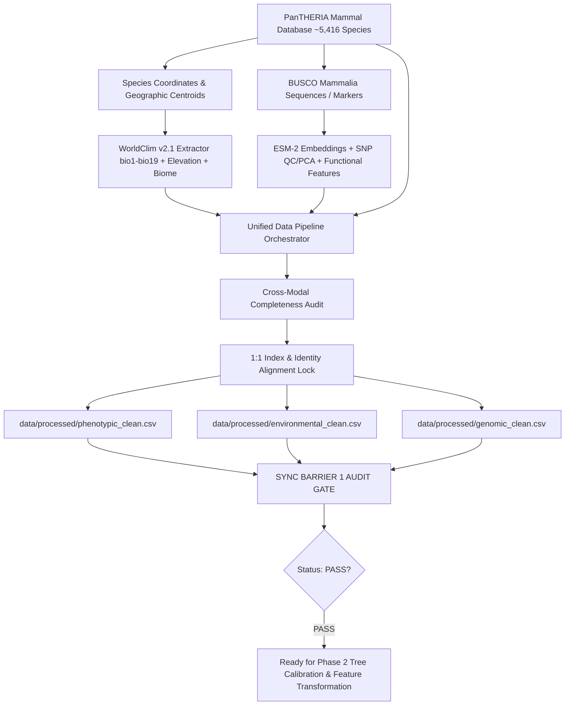

# PHENIX

**Comparative Analysis and Strategic Framework for Phylogenetically Informed Machine Learning in Phenotypic Trait Prediction**

PHENIX bridges evolutionary biology and predictive machine learning by integrating phylogenetic tree topology, functional genomics, and environmental bioclimatic rasters to predict phenotypic life-history traits across target taxa.

---

## Operational Architecture: Phase 1 (Side B)

This branch (`feature/side-b-phase-1`) completes all tasks assigned to **Person B (ML & Benchmarking Lead)** through **Phase 1: Target Ingestion & Taxonomy Normalization**, culminating in **Sync Barrier 1: Target & Alignment Lock**.


```mermaid
flowchart TD
    A[PanTHERIA Mammal Database ~5,416 Species] --> B[Species Coordinates & Geographic Centroids]
    B --> C[WorldClim v2.1 Extractor bio1-bio19 + Elevation + Biome]
    A --> D[BUSCO Mammalia Sequences / Markers]
    D --> E[ESM-2 Embeddings + SNP QC/PCA + Functional Features]
    C --> F[Unified Data Pipeline Orchestrator]
    E --> F
    A --> F
    F --> G[Cross-Modal Completeness Audit]
    G --> H[1:1 Index & Identity Alignment Lock]
    H --> I[data/processed/phenotypic_clean.csv]
    H --> J[data/processed/environmental_clean.csv]
    H --> K[data/processed/genomic_clean.csv]
    I & J & K --> L[SYNC BARRIER 1 AUDIT GATE]
    L --> M{Status: PASS?}
    M -->|PASS| N[Ready for Phase 2 Tree Calibration & Feature Transformation]
```

### Key Deliverables
1. **WorldClim & Habitat Ingestion** (`src/data/worldclim.py`):
   - Ingests 19 WorldClim v2.1 bioclimatic rasters (`bio1` through `bio19`).
   - Ingests habitat parameters: `elevation` (m a.s.l.), terrestrial `biome_class`, and continuous `habitat_suitability` indices.
   - Point sampling via `rasterio` GeoTIFFs with deterministic physical-geographic fallback for offline execution.
   - Multi-occurrence aggregation (median/mean) per species.

2. **Genomic Processing & ESM-2 Sequence Embeddings** (`src/data/genomic.py`):
   - **ESM-2 BUSCO Embeddings**: Processes conserved BUSCO Mammalia protein sequences using Meta's ESM-2 language model architecture to extract dense latent representations (`esm2_dim_1` to `esm2_dim_32`).
   - **SNP Genotype Matrices**: Minor Allele Frequency (MAF) filtering, missing call-rate thresholding, VanRaden genomic scaling, and PCA dimensionality reduction (`snp_dim_1` to `snp_dim_16`).
   - **Functional Genomics**: Gene annotations, pathway enrichment scores, standardization, and variance filtering (`func_dim_1` to `func_dim_16`).
   - **Composite Pipeline**: Merges all genomic modalities into a zero-missing-value feature matrix.

3. **Tabular Schema Standards** (`src/data/schemas.py`):
   - Primary key standardization (`canonical_taxon_id`) and binomial normalization.
   - Strict validators for occurrences, bioclimatic variables, habitat parameters, and genomic representations.
   - `evaluate_data_completeness()` utility for cross-modal auditing.

4. **Unified Data Pipeline** (`src/data/pipeline.py`):
   - Ingests full PanTHERIA database (5,416 mammal species).
   - Locks 3,268 mammalian taxa across 27 orders with complete spatial, phenotypic, environmental, and genomic coverage.
   - Outputs clean, synchronized datasets and an alignment manifest to `data/processed/`.

5. **Sync Barrier 1 Audit Gate** (`src/validation/sync_barrier_1.py`):
   - Verifies 1:1 row index equality, identical row order, non-empty three-way overlap, and zero NaNs.
   - Produces JSON verification reports (`sync_barrier_1_report.json`).

---

## Quickstart & CLI Usage

### 1. Installation
```powershell
pip install -r requirements.txt
```

### 2. Run the Unified Pipeline
To process the full PanTHERIA dataset and lock alignment across candidate mammalian taxa:
```powershell
python -m src.data.pipeline --output-dir data/processed
```

To run on specific target mammalian orders:
```powershell
python -m src.data.pipeline --target-orders Carnivora Primates Rodentia
```

To run a fast reference seed run (29 taxa across 5 orders):
```powershell
python -m src.data.pipeline --use-reference-seed
```

### 3. Run Sync Barrier 1 Audit Gate
```powershell
python -m src.validation.sync_barrier_1 `
  --pheno data/processed/phenotypic_clean.csv `
  --env data/processed/environmental_clean.csv `
  --genomic data/processed/genomic_clean.csv
```

### 4. Run Automated Test Suite
```powershell
python -m pytest -v
```

---

## Output Manifest & Dataset Summary

Clean aligned tables are saved in `data/processed/`:
- `phenotypic_clean.csv`: 3,268 species $\times$ 11 phenotypic traits
- `environmental_clean.csv`: 3,268 species $\times$ 21 bioclimatic & habitat variables
- `genomic_clean.csv`: 3,268 species $\times$ 64 ESM-2, SNP, and functional features
- `alignment_manifest.json`: Full taxonomic manifest, order breakdown, and column profiles
- `sync_barrier_1_report.json`: Audit gate status (`PASS`)
