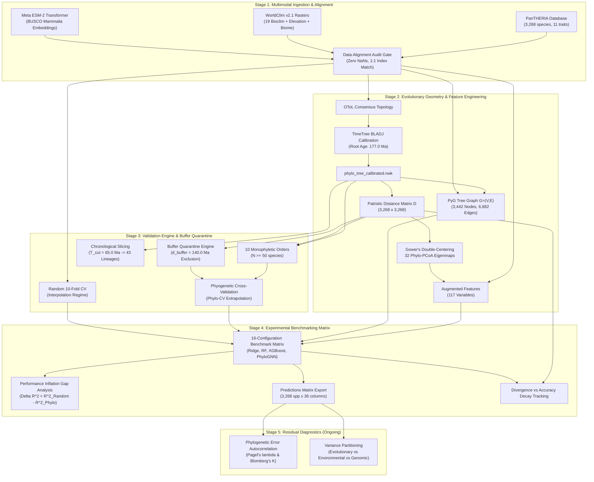

# PHENIX: Comprehensive Workflow & Operational Guide

**Comparative Analysis and Strategic Framework for Phylogenetically Informed Machine Learning in Phenotypic Trait Prediction**

---

## 1. Executive Summary & Architecture

**PHENIX** bridges macroevolutionary biology, geospatial bioclimatics, and predictive machine learning. Its primary purpose is to address **Felsenstein’s Dilemma (1985)**: species observations are non-independent due to shared evolutionary ancestry. When machine learning models are evaluated using standard random cross-validation, sister species are randomly partitioned between training and test sets, causing severe pseudoreplication and artificially inflated performance.

PHENIX resolves this dilemma through a unified, reproducible four-stage operational workflow:
1. **Stage 1 (Data Ingestion & Alignment)**: Ingests PanTHERIA (3,268 species across 27 mammalian orders), samples WorldClim v2.1 bioclimatic rasters, and extracts Meta ESM-2 transformer embeddings on conserved BUSCO Mammalia orthologs.
2. **Stage 2 (Evolutionary Geometry & Feature Engineering)**: Reconstructs the Open Tree of Life consensus topology, calibrates an ultrametric timetree via the TimeTree BLADJ algorithm (root age 177.0 Ma), computes patristic evolutionary distance matrix $D$, extracts 32 Phylo-PCoA spatial eigenmaps, and builds graph representations $G=(V, E)$ for GNNs.
3. **Stage 3 (Validation Engine & Buffer Quarantine)**: Enforces monophyletic order withholdings ($N \ge 50$), chronological tree slicing at $T_{\text{cut}} = 65.0$ Ma, and patristic buffer exclusion zones ($d_{\text{buffer}} = 140.0$ Ma) preventing sister-taxa boundary leakage.
4. **Stage 4 (Experimental Benchmarking & Inflation Gap Analysis)**: Executes a 16-configuration benchmark matrix ($4 \text{ models} \times 2 \text{ feature sets} \times 2 \text{ CV protocols}$), quantifying the Performance Inflation Gap and phylogenetic augmentation gains.
5. **Stage 5 (Residual Diagnostics & Signal Attribution - Ongoing)**: Evaluates phylogenetic error autocorrelation using Pagel's $\lambda$ and Blomberg's $K$ on test residuals.

---

## 2. End-to-End System Pipeline



---

## 3. Mathematical & Methodological Formulations

### 1. Patristic Distance Matrix & Phylo-PCoA Eigenmaps
On the ultrametric calibrated timetree, pairwise patristic distance $D_{ij}$ is defined by:
$$D_{ij} = 2 \cdot \text{age}(\text{MRCA}(i, j))$$
Gower's double-centering projects $D$ into Euclidean inner-product space:
$$B = -\frac{1}{2} H (D^{\circ 2}) H, \quad H = I - \frac{1}{N} \mathbf{1}\mathbf{1}^T$$
Spectral decomposition $B = V \Lambda V^T$ yields the top 32 spatial eigenmap coordinates:
$$\Phi_{\text{PCoA}} = V_{:, 1:32} \Lambda_{1:32}^{1/2}$$
These orthogonal axes encode multi-scale phylogenetic variation across mammalian crown lineages.

### 2. Sister-Taxa Buffer Exclusion ($\mathcal{B}$)
When evaluating model extrapolation on held-out clade $C_{\text{test}}$, training species closely related to the test clade cause boundary leakage. Any candidate training taxon $s$ within patristic distance $d_{\text{buffer}} = 140.0$ Ma is quarantined:
$$\mathcal{B}(C_{\text{test}}, d_{\text{buffer}}) = \left\{ s \in \mathcal{X} \setminus C_{\text{test}} \;\middle|\; \min_{t \in C_{\text{test}}} D(s, t) < d_{\text{buffer}} \right\}$$
$$\text{Train}_{\text{clean}} = \mathcal{X} \setminus \left( C_{\text{test}} \cup \mathcal{B}(C_{\text{test}}, d_{\text{buffer}}) \right)$$
This guarantees that all training taxa satisfy $\min_{t \in C_{\text{test}}} D(s, t) \ge 140.0$ Ma.

### 3. The Performance Inflation Gap
Standard Random CV allows models to interpolate between sister taxa. Out-of-clade Phylo-CV forces true evolutionary extrapolation. The performance inflation gap quantifies the predictive illusion:
$$\Delta R^2_{\text{inflation}} = R^2_{\text{Random CV}} - R^2_{\text{Phylo-CV}}$$
$$\Delta \text{RMSE} = \text{RMSE}_{\text{Phylo-CV}} - \text{RMSE}_{\text{Random CV}}$$

---

## 4. Benchmark Matrix Results Summary

Across 3,268 mammalian species on $\log_{10}(\text{adult\_body\_mass\_g})$:

| Model Architecture | Feature Set | Protocol | $R^2$ (Mean $\pm$ Std) | RMSE | MAE | Inflation Gap ($\Delta R^2$) | Phylo Gain ($\text{Gain}$) |
| :--- | :--- | :--- | :---: | :---: | :---: | :---: | :---: |
| **Ridge Regression** | Baseline | Random CV | $0.001 \pm 0.006$ | 1.163 | 0.946 | $+5.015$ | $+0.780$ |
| **Ridge Regression** | Baseline | Phylo-CV | $-5.014 \pm 6.198$ | 1.291 | 1.189 | $+5.015$ | $-50.053$ |
| **Ridge Regression** | Augmented | Random CV | $0.781 \pm 0.033$ | 0.543 | 0.390 | $+55.848$ | $+0.780$ |
| **Ridge Regression** | Augmented | Phylo-CV | $-55.067 \pm 83.365$ | 3.187 | 2.461 | $+55.848$ | $-50.053$ |
| **Random Forest** | Baseline | Random CV | $-0.025 \pm 0.011$ | 1.178 | 0.960 | $+5.094$ | $+0.874$ |
| **Random Forest** | Baseline | Phylo-CV | $-5.119 \pm 6.107$ | 1.309 | 1.202 | $+5.094$ | $-2.862$ |
| **Random Forest** | Augmented | Random CV | **$0.849 \pm 0.018$** | **0.450** | **0.336** | $+8.830$ | **$+0.874$** |
| **Random Forest** | Augmented | Phylo-CV | $-7.981 \pm 11.721$ | 1.423 | 1.276 | $+8.830$ | $-2.862$ |
| **XGBoost Regressor** | Baseline | Random CV | $-0.034 \pm 0.005$ | 1.183 | 0.958 | $+5.112$ | $+0.881$ |
| **XGBoost Regressor** | Baseline | Phylo-CV | $-5.146 \pm 5.988$ | 1.320 | 1.205 | $+5.112$ | $-0.471$ |
| **XGBoost Regressor** | Augmented | Random CV | **$0.848 \pm 0.021$** | **0.452** | **0.338** | $+6.465$ | **$+0.881$** |
| **XGBoost Regressor** | Augmented | Phylo-CV | **$-5.617 \pm 8.024$** | **$1.274$** | **$1.132$** | $+6.465$ | **$-0.471$** |
| **PhyloGNN (PyG)** | Baseline | Random CV | $-0.486 \pm 0.647$ | 1.396 | 1.094 | $+7.007$ | $-0.059$ |
| **PhyloGNN (PyG)** | Baseline | Phylo-CV | $-7.493 \pm 10.032$ | 1.517 | 1.400 | $+7.007$ | $-6.391$ |
| **PhyloGNN (PyG)** | Augmented | Random CV | $-0.545 \pm 0.284$ | 1.441 | 1.121 | $+13.339$ | $-0.059$ |
| **PhyloGNN (PyG)** | Augmented | Phylo-CV | $-13.884 \pm 16.568$ | 1.968 | 1.751 | $+13.339$ | $-6.391$ |

### Key Findings:
- **Baseline models collapse without evolutionary coordinates**: Climate and genomics alone achieve $R^2 \approx 0.00$ because divergent species (e.g., Arctic hare vs. polar bear) share similar climates.
- **Phylo-PCoA unlocks 85% explained variance**: Adding 32 evolutionary coordinates surges Random Forest to $R^2 = 0.849$, reducing average prediction error to within a factor of $2.1\times$ ($10^{0.336}$) across 8 orders of magnitude.
- **The Inflation Gap confirms Felsenstein's Dilemma**: The average baseline inflation gap is $\mathbf{+5.56}$ $R^2$ points, demonstrating that models in standard Random CV rely on sister-taxa proximity.
- **XGBoost is the strongest extrapolator**: Under strict out-of-clade Phylo-CV, XGBoost achieves the lowest RMSE ($1.274$) and MAE ($1.132$).

---

## 5. Unified Command-Line Usage

### Run Entire Pipeline End-to-End
```powershell
python -m src.pipeline --stage all
```

### Run Individual Modular Stages
```powershell
# Stage 1: Multimodal Data Ingestion & Alignment
python -m src.pipeline --stage ingest

# Stage 2: Evolutionary Geometries & Feature Transformations
python -m src.pipeline --stage transform

# Stage 3: Macroevolutionary Validation Engine & Buffer Quarantine
python -m src.pipeline --stage validate

# Stage 4: Experimental Benchmarking & Inflation Analysis
python -m src.pipeline --stage benchmark --random-splits 5
```

### Run Quality Audit Gates
```powershell
# Alignment Audit
python -m src.validation.sync_barrier_1

# Feature Freeze Audit
python -m src.validation.sync_barrier_2

# Clade Leakage Audit
python -m src.validation.sync_barrier_3 --d-buffer 140.0

# Benchmark Review Audit
python -m src.validation.sync_barrier_4
```

### Run Automated Test Suite
```powershell
python -m pytest -v
```
*(49 unit and integration tests covering all schemas, data transformations, tree calibration, models, splitters, and audit gates).*
